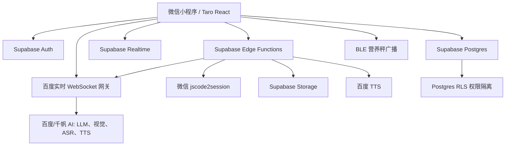
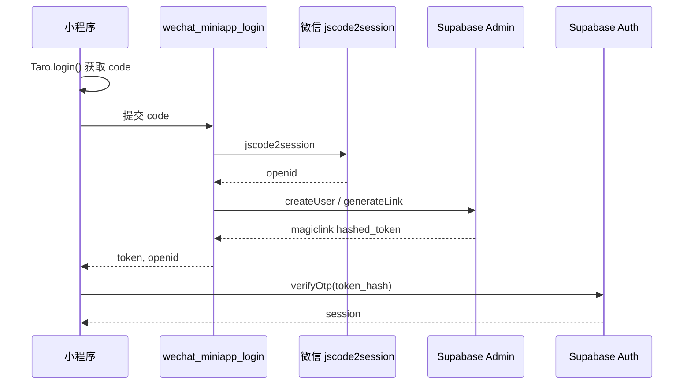
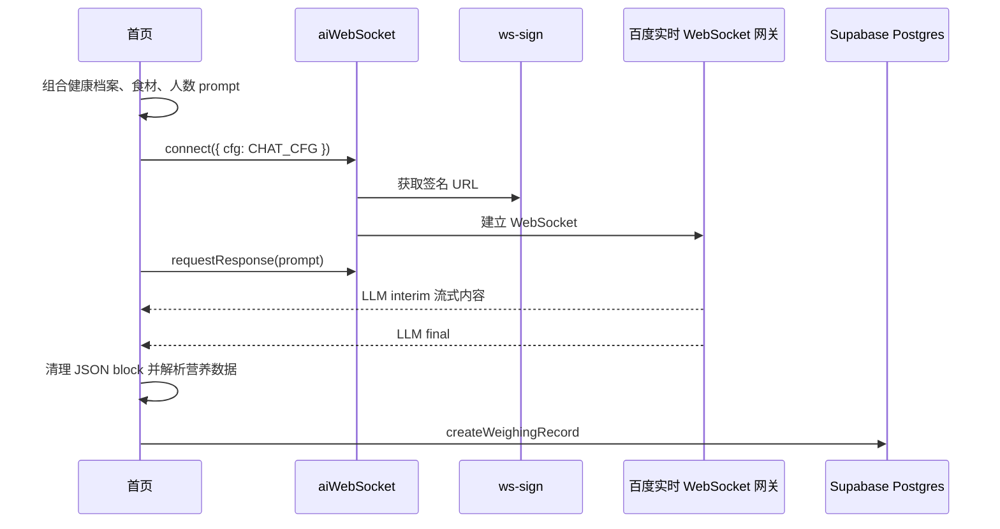
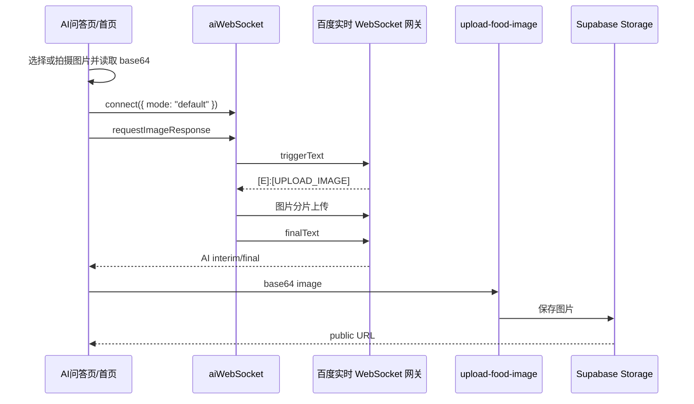

# 智能健康助手小程序系统架构现状报告

生成日期：2026-06-26

## 1. 报告摘要

本系统为「智能健康助手 / AI营养秤小程序」，当前以微信小程序为主要交互端，采用 Taro + React + TypeScript 实现，后端能力主要由 Supabase 提供，包括 Auth、Postgres、Storage、Realtime 与 Edge Functions。系统同时接入 BLE 营养秤广播协议、百度实时 WebSocket AI 网关、百度 TTS/ASR/视觉/LLM 能力，形成「硬件称重 + 食材录入 + AI营养分析 + 健康档案 + 饮食统计 + 多轮问答」的业务闭环。

当前架构不是传统的「品类后台统一服务 + 小程序前端」形态，而是「小程序前端直连 Supabase 数据层与 Edge Functions，Edge Functions 承担少量 BFF/密钥代理职责」。如果后续要并入品类后台，当前需要重点识别的边界是：用户身份体系、业务数据模型、AI 服务代理、图片/音频存储、设备绑定与统计聚合。

主要代码依据：

- `src/app.config.ts`：页面路由、TabBar 与小程序全局配置。
- `src/app.tsx`：应用入口、鉴权上下文与全局状态 Provider 注入。
- `src/contexts/AuthContext.tsx`：登录态、Supabase Auth 与微信登录封装。
- `src/store/appStore.tsx`：当前家庭成员、BLE、食材、人数、网络状态。
- `src/db/api.ts`：业务数据访问 API。
- `src/db/types.ts`：核心业务类型。
- `src/services/aiWebSocket.ts`：AI WebSocket 客户端。
- `src/utils/bleService.ts`：BLE 广播协议解析与连接状态维护。
- `supabase/migrations/00001_initial_health_schema.sql`：业务数据库 schema 与 RLS。
- `supabase/functions/*/index.ts`：后端 Edge Functions。

## 2. 当前系统架构



### 2.1 前端层

前端采用 Taro 4 + React 18 + TypeScript，目标平台为微信小程序，同时保留 H5 构建能力。页面包括首页、AI 问答、统计、我的、设备管理、设备添加、个人资料、家庭成员、菜谱推荐、提醒设置、登录、协议与隐私页。

小程序路由由 `src/app.config.ts` 管理，底部 TabBar 包含：

- 首页：称重、食材录入、AI营养分析。
- AI问答：健康顾问、多轮对话、图片问答、语音通话。
- 统计：饮食记录聚合、热量趋势、营养目标对比。
- 我的：个人中心、设备入口、档案入口、家庭成员入口、提醒入口。

### 2.2 状态层

状态层由两个核心 Provider 组成：

- `AuthContext`：管理 Supabase session、当前用户、用户 profile、用户名密码登录、手机号 OTP 预留、微信小程序登录、退出登录。
- `AppProvider`：管理当前家庭成员、家庭成员列表、BLE 连接状态、当前设备、当前重量、重量单位、稳定状态、食材列表、用餐人数、网络状态。

状态设计整体偏前端聚合，页面层会直接调用 `src/db/api.ts` 读写业务表，并把必要状态同步到全局 Context。

### 2.3 数据层

业务读写集中封装在 `src/db/api.ts`，通过 Supabase SDK 访问 Postgres 表。统计页通过 Supabase Realtime 订阅 `weighing_records` 的新增事件，在首页完成 AI 分析并落库后刷新统计数据。

数据权限主要依赖 Supabase Postgres RLS。普通用户只能访问自己的 profile、家庭成员、设备、称重记录、会话和提醒配置；管理员角色在 `profiles` 表中预留。

### 2.4 服务层

当前 Edge Functions 包括：

| Edge Function | 职责 |
|---|---|
| `wechat_miniapp_login` | 用微信小程序 code 换 openid，创建或复用 Supabase 用户，并生成 magiclink token |
| `ws-sign` | 读取百度 BRTC/实时网关密钥，生成 WebSocket URL，并返回 License 配置 |
| `upload-food-image` | 接收 base64 图片，用 service role 上传到 `chat-images` Storage bucket |

Edge Functions 当前更接近轻量 BFF 和密钥代理，没有承载完整业务服务编排。

### 2.5 设备层

BLE 当前不走 GATT 长连接控制，核心实现为监听营养秤广播包。`bleService` 解析厂商自定义数据中的重量、单位、正负号、小数位和稳定状态，并用心跳超时判断设备是否断开。

当前实现要点：

- 扫描设备用于添加和探测。
- 绑定设备后，首页统一启动广播监听。
- 设备连接状态本质上是「是否持续收到目标设备广播」。
- 数据表中保留 `battery_level`，但当前 v2.2 广播协议不含电量字段。

## 3. 核心业务模块

### 3.1 登录与鉴权

系统支持用户名密码登录、注册、手机号 OTP 预留能力和微信小程序登录。

微信登录链路：



当前路由保护由 `RouteGuard` 通过 HOC 包裹页面实现。未登录用户访问受保护页面时，会记录跳转前路径并跳转登录页。

### 3.2 首页称重与营养分析

首页是主业务入口，负责：

- 加载家庭成员、称重历史和绑定设备。
- 在免责声明确认后初始化 BLE，避免隐私弹窗与系统权限弹窗同时出现。
- 监听营养秤广播并展示当前重量、单位和稳定状态。
- 支持手动输入、语音识别、拍照识别录入食材。
- 对食材进行过敏源匹配和预警展示。
- 调用 AI 进行营养分析，流式展示 Markdown。
- 从 AI 返回内容中解析热量、蛋白质、脂肪、碳水，并写入 `weighing_records`。

首页 AI 分析链路：



### 3.3 AI问答

AI问答页支持：

- 多轮会话。
- 历史会话列表。
- 新建、删除、批量删除会话。
- 文字问答。
- 图片问答。
- 实时语音通话。
- 是否携带健康档案和当前食材上下文。

文本与图片问答均通过 `aiWebSocket` 连接百度实时网关。AI 回复先以临时 assistant 消息流式展示，最终结果落库后替换临时消息。

图片问答链路：



### 3.4 统计页

统计页基于 `weighing_records` 聚合今日、本周、本月数据，展示：

- 热量趋势。
- 平均/总热量。
- 蛋白质、脂肪、碳水分布。
- 当前家庭成员营养目标对比。

当前统计聚合由 `getNutritionStats` 在前端查询记录后按日期分组完成，没有独立统计服务、物化视图或报表表。

### 3.5 设备管理

设备管理模块支持：

- 添加新设备。
- 扫描附近 BLE 设备。
- 按 RSSI 推荐信号最强设备。
- 设备命名与绑定。
- 在线探测。
- 解绑设备。

设备数据持久化在 `devices` 表。添加设备时只保存设备信息，广播监听由首页统一发起，避免添加页与首页抢占 BLE 扫描状态。

### 3.6 健康档案与家庭成员

健康档案包括：

- 性别、年龄、身高、体重、生日、血型。
- 慢性病。
- 过敏源。
- 正在服用的药物。
- 每日热量目标。
- 家庭成员昵称与头像。

家庭成员支持新增、编辑、切换和删除，主用户档案不可删除。当前激活成员记录在 `user_active_member` 表中。

AI prompt 会通过 `buildHealthContext` 携带当前成员健康档案。过敏源预警由 `allergenUtils` 基于本地关键词匹配完成，命中后在首页和菜谱页提示。

### 3.7 菜谱推荐

菜谱推荐页基于当前食材和健康档案调用 AI，输出 Markdown 菜谱，包含菜名、食材用量、烹饪步骤和营养特点。页面支持：

- 自动生成菜谱。
- 流式展示。
- 过敏源提示。
- 换一个。
- 继续咨询。
- 微信分享。

### 3.8 提醒设置

提醒设置支持早餐、午餐、晚餐、饮水提醒配置，并保存到 `reminder_settings`。当前页面会在开启提醒时请求微信订阅消息授权，但模板 ID 仍为占位值，页面也明确提示「提醒功能开发中，授权后将在后续版本生效」。

## 4. 数据模型与接口边界

### 4.1 核心业务表

| 表 | 用途 |
|---|---|
| `profiles` | 用户基础资料、openid、角色、免责声明/引导状态 |
| `family_members` | 家庭成员健康档案、慢性病、过敏源、营养目标 |
| `user_active_member` | 当前选中的家庭成员 |
| `devices` | 用户绑定的营养秤设备 |
| `weighing_records` | 食材、人数、AI分析结果、热量及三大营养素 |
| `chat_sessions` | AI会话及上下文 |
| `chat_messages` | AI会话消息、图片 URL |
| `reminder_settings` | 餐前和饮水提醒设置 |

### 4.2 安全模型

业务表均开启 RLS。普通用户只能操作自己的数据，主要规则如下：

- `profiles`：用户可查看和更新自己的资料；管理员预留完整权限。
- `family_members`、`devices`、`weighing_records`、`chat_sessions`、`reminder_settings`：通过 `user_id = auth.uid()` 隔离。
- `chat_messages`：通过所属 `chat_sessions.user_id` 反查归属。
- `profiles.role` 有管理员策略，但当前小程序侧未看到完整后台管理入口。

### 4.3 存储模型

| Bucket | 用途 | 当前策略 |
|---|---|---|
| `chat-images` | 食物识别、聊天图片 | 公开读；authenticated 可按用户目录上传；anon 也可插入 |
| `generated-audio` | TTS 生成音频 | 公开读；允许插入 |

图片上传在小程序端受二进制 body 能力限制，实际通过 `upload-food-image` Edge Function 将 base64 解码后服务端转存。

### 4.4 AI接口边界

小程序通过 `ws-sign` 获取百度实时 WebSocket URL，再直接连接百度网关。`CHAT_CFG`、`VOICE_CFG`、`VISION_CFG` 目前在前端配置，其中仍包含千帆 LLM token，属于当前安全风险，应在生产治理中标记为整改项。

当前 AI 能力分布：

| 能力 | 前端入口 | 服务封装 | 后端/外部依赖 |
|---|---|---|---|
| 文本问答 | `chat`、`home`、`recipe` | `aiWebSocket.requestResponse` | 百度实时 WebSocket 网关、千帆 LLM |
| 图片识别/图片问答 | `home`、`chat` | `aiWebSocket.requestImageResponse` | 百度实时 WebSocket 网关、Supabase Storage |
| 语音输入/语音通话 | `home`、`chat` | `aiWebSocket.sendAudio` | 百度 ASR/LLM/TTS |

## 5. 关键链路

### 5.1 微信登录链路

小程序 code -> `wechat_miniapp_login` -> 微信 jscode2session -> Supabase admin createUser/generateLink -> 小程序 verifyOtp -> Supabase session。

### 5.2 AI文本链路

页面构造 prompt -> `ws-sign` 签名 -> Taro WebSocket -> 百度实时网关 -> LLM interim/final -> 页面流式渲染 -> Supabase 落库。

### 5.3 图片识别链路

选择/拍摄图片 -> 压缩和 base64 -> WebSocket 等待上传事件并分片发送图片 -> AI 返回食材名 -> 并行调用 `upload-food-image` 保存图片 -> 食材加入列表。

### 5.4 称重链路

设备广播 -> `bleService` 解析厂商数据 -> 更新全局重量/单位/稳定状态 -> 首页录入食材 -> AI 分析 -> `weighing_records` 落库 -> 统计页 Realtime 刷新。

### 5.5 健康安全链路

健康档案 -> prompt 上下文 -> AI 建议附加医疗免责声明；过敏源 -> 本地关键词匹配 -> 食材与菜谱展示预警。

## 6. 当前架构风险与注意点

| 风险/注意点 | 当前状态 | 影响 |
|---|---|---|
| 前端持有 `QIANFAN_TOKEN` | `src/utils/brtcConfig.ts` 中存在 LLM token | 不适合生产长期暴露，建议迁移到服务端 cfg 托管 |
| Supabase 边界较重 | Auth、DB、Storage、Realtime、Edge Functions 均由 Supabase 承担 | 后续并入品类后台时，需要重新定义 Auth、用户、设备、AI代理、文件、统计等接口归属 |
| 统计聚合在前端完成 | `getNutritionStats` 查询后本地分组 | 数据量增长后会影响性能和口径一致性 |
| 提醒功能未完全闭环 | 订阅消息模板仍为占位 ID | 当前更接近「设置保存」，不是完整提醒服务 |
| BLE 控制能力有限 | 当前 v2.2 实现主要是广播解析 | PRD 中的电量、单位切换、去皮控制需按实际硬件协议再确认 |
| `chat-images` 允许 anon 插入 | 便于登录态未就绪时上传 | 需要配套大小、频控、鉴黄/内容安全与清理策略 |
| 管理员角色未形成后台能力 | `profiles.role` 与 RLS 预留管理员策略 | 当前小程序侧未看到完整后台管理入口 |

## 7. 测试与验收现状

### 7.1 已有检查脚本

已有检查脚本覆盖 AI prompt 和聊天流式关键路径：

```bash
node scripts/checkAiPromptHelpers.mjs
node scripts/checkChatStreaming.mjs
```

已有构建与 lint 脚本：

```bash
pnpm build:weapp
pnpm lint
```

历史迁移报告显示 WebSocket 迁移后这些检查曾通过，但交付前仍应重新执行一次。

### 7.2 建议产研验收场景

| 场景 | 验收点 |
|---|---|
| 微信登录 | 小程序 code 登录成功，Supabase session 正常建立 |
| 用户协议/免责声明 | 未确认时阻断核心使用，确认后写入 profile |
| 设备扫描绑定 | 能扫描、选择、命名、保存设备 |
| 首页广播称重 | 设备广播触发重量、单位、稳定状态更新 |
| 手动录入食材 | 未连接设备时可手动输入重量 |
| 语音录入食材 | PCM 录音经 ASR 返回食材名 |
| 拍照识别食材 | 图片识别返回食材名，同时上传图片 |
| 营养分析落库 | AI 流式展示，最终写入 `weighing_records` |
| 统计页刷新 | 新增称重记录后统计页能刷新展示 |
| AI文本问答 | 文字问题流式生成回复并落库 |
| AI图片问答 | 上传图片后 AI 能结合图片回答 |
| 语音通话 | ASR/LLM 中间结果能实时展示 |
| 家庭成员切换 | 切换后健康档案、统计和 AI 上下文使用当前成员 |
| 过敏源预警 | 命中关键词后首页/菜谱页展示预警 |
| 菜谱生成 | 根据当前食材和健康档案生成 Markdown 菜谱 |
| 提醒设置保存 | 提醒配置写入 `reminder_settings` |
| 退出登录 | 清理本地登录态并回到登录页 |

## 8. 明确假设

- 本报告按「仅现状梳理」范围输出，不展开并入品类后台后的目标服务拆分和迁移计划。
- 本报告基于当前仓库静态代码、数据库迁移和已有文档梳理，未连接线上 Supabase 或真实微信开发者工具验证运行状态。
- 当前「品类后台」未提供现有接口、用户体系、设备体系或数据规范，因此报告中只标注当前系统边界，不替代后续对接设计。
