# 智能健康助手系统架构与运维说明书

> 文档版本：2.0
> 代码基线日期：2026-07-21
> 适用范围：当前仓库中的微信小程序前端、Supabase 数据库/Storage/Edge Functions、百度 BRTC 实时 AI 链路、微信登录与订阅消息、BLE 营养秤。
> 事实来源：本文以当前源码和数据库迁移为准；历史设计文档仅作背景参考。

## 1. 文档目标与阅读说明

本文用于回答以下问题：

1. 当前系统由哪些模块组成，各模块之间如何调用。
2. 百度 BRTC 的鉴权、建连、文本、图片、语音、TTS 和历史记录链路如何工作。
3. 登录、注册、微信身份绑定、会话恢复和路由保护如何工作。
4. 本地构建、Supabase、百度和微信平台分别需要配置哪些环境变量。
5. 发布、监控、排障、密钥轮换和数据治理时应关注什么。

本文中的“当前实现”表示源码已经实际使用的路径；“保留能力”表示表、类型或函数仍存在，但当前主页面链路不一定使用；“建议”表示运维或架构改进项，不代表已经实现。

## 2. 系统摘要

系统是一个以微信小程序为主入口的 AI 营养健康应用，核心能力包括：

- 微信小程序与用户名密码登录。
- 家庭成员健康档案和当前用餐成员管理。
- BLE 营养秤广播数据接收。
- 食材手工录入、拍照识别、营养分析和饮食记录。
- 百度 BRTC 驱动的文本问答、流式 TTS、图片理解和按住说话 ASR。
- 百度 RTC 云端对话历史读取。
- 营养统计、菜谱生成与公开分享。
- 微信一次性订阅提醒。

系统不是传统的独立业务后端架构。小程序对普通业务表直接使用 Supabase SDK，在 RLS 约束下读写；只有需要服务端密钥、平台 API、公开分享或任务调度的操作才进入 Supabase Edge Functions。

## 3. 整体系统架构图

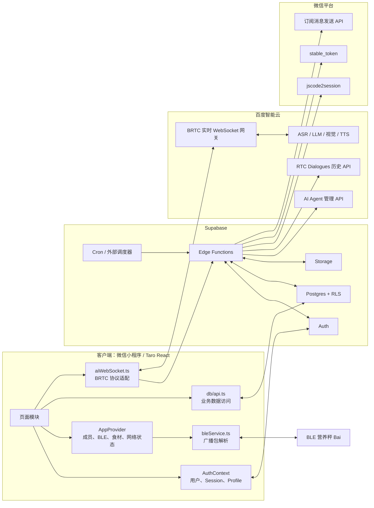
```mermaid
flowchart LR
  subgraph Client["客户端：微信小程序 / Taro React"]
    Pages["页面模块"]
    AuthCtx["AuthContext\n用户、Session、Profile"]
    AppCtx["AppProvider\n成员、BLE、食材、网络状态"]
    DBAPI["db/api.ts\n业务数据访问"]
    AIWS["aiWebSocket.ts\nBRTC 协议适配"]
    BLE["bleService.ts\n广播包解析"]
  end

  subgraph Supabase["Supabase"]
    Auth["Auth"]
    PG["Postgres + RLS"]
    Storage["Storage"]
    EF["Edge Functions"]
    Cron["Cron / 外部调度器"]
  end

  subgraph Baidu["百度智能云"]
    AgentAPI["AI Agent 管理 API"]
    Gateway["BRTC 实时 WebSocket 网关"]
    Dialogues["RTC Dialogues 历史 API"]
    Models["ASR / LLM / 视觉 / TTS"]
  end

  subgraph WeChat["微信平台"]
    LoginAPI["jscode2session"]
    TokenAPI["stable_token"]
    SubscribeAPI["订阅消息发送 API"]
  end

  Scale["BLE 营养秤 Bai"]

  Pages --> AuthCtx
  Pages --> AppCtx
  Pages --> DBAPI
  Pages --> AIWS
  AppCtx --> BLE
  BLE <--> Scale
  AuthCtx <--> Auth
  DBAPI <--> PG
  AIWS --> EF
  AIWS <--> Gateway
  Gateway <--> Models
  EF <--> Auth
  EF <--> PG
  EF <--> Storage
  EF --> AgentAPI
  EF --> Dialogues
  EF --> LoginAPI
  EF --> TokenAPI
  EF --> SubscribeAPI
  Cron --> EF
```

### 3.1 核心信任边界

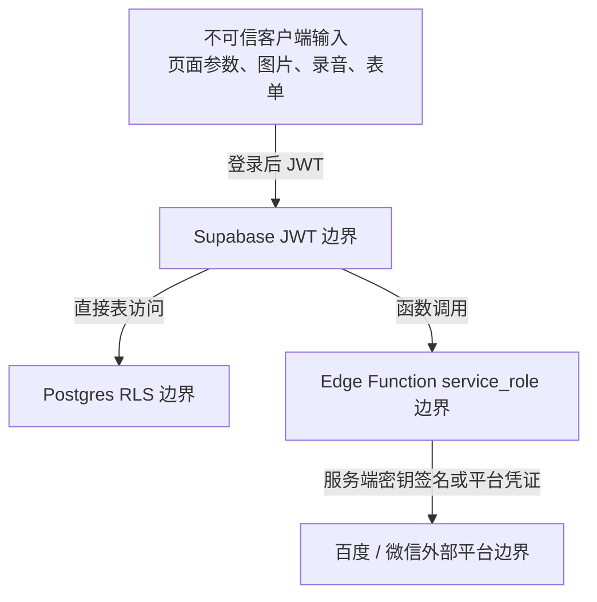
```mermaid
flowchart TB
  Public["不可信客户端输入\n页面参数、图片、录音、表单"]
  JWT["Supabase JWT 边界"]
  RLS["Postgres RLS 边界"]
  ServiceRole["Edge Function service_role 边界"]
  Vendor["百度 / 微信外部平台边界"]

  Public -->|登录后 JWT| JWT
  JWT -->|直接表访问| RLS
  JWT -->|函数调用| ServiceRole
  ServiceRole -->|服务端密钥签名或平台凭证| Vendor
```

- 小程序中只能出现可公开的 Supabase anon key，不能出现 service-role、百度 AK/SK、微信 AppSecret 或调度密钥。
- 普通数据访问的最终授权点是 Postgres RLS，不是页面是否显示按钮。
- 使用 service role 的 Edge Function 必须自行校验 JWT、一次性 ticket 或专用调度密钥。
- 百度 BRTC 的 WebSocket URL 含短期实例 token，日志只能记录固定前缀，不能记录完整 URL。

## 4. 技术栈与运行形态

| 层级 | 当前技术 | 作用 |
|---|---|---|
| 客户端框架 | Taro 4.1.10、React 18、TypeScript | 微信小程序主运行端，同时保留 H5 构建能力 |
| 样式 | Tailwind CSS、weapp-tailwindcss | 跨小程序样式编译 |
| 全局状态 | React Context | `AuthContext` 和 `AppProvider` |
| 数据 SDK | Supabase JS 2.103.1 / `supabase-wechat-js` | Auth、Postgres、Functions、Storage 访问 |
| 后端运行时 | Supabase Edge Functions / Deno | 密钥代理、BFF、公开分享、通知任务 |
| 数据库 | Supabase Postgres + RLS | 用户、成员、设备、称重、通知、分享等数据 |
| AI 实时链路 | 百度 BRTC AI Agent + WebSocket | ASR、LLM、视觉、TTS 与云端对话历史 |
| 设备接入 | 微信 BLE API | 监听 `Bai` 营养秤广播，不建立 GATT 连接 |
| 平台能力 | 微信登录、订阅消息、相册/相机、录音 | 身份、提醒和多模态输入 |

构建时，非 H5 平台会把 `@supabase/supabase-js` alias 到 `supabase-wechat-js`，并由自定义 `Taro.request` fetch 适配器处理请求和响应头。

## 5. 代码分层与模块边界

```text
src/
├── app.tsx                    应用 Provider 装配
├── app.config.ts              路由、TabBar、小程序全局配置
├── client/supabase.ts         Supabase 客户端与 Taro 存储/fetch 适配
├── components/                路由守卫、Markdown、过敏提示等共享组件
├── contexts/AuthContext.tsx   登录态与 Profile
├── db/api.ts                  普通业务表与 brtc-history 的访问封装
├── db/types.ts                业务数据类型
├── pages/                     页面与用户流程
├── services/                  BRTC、微信身份、通知、菜谱分享
├── store/appStore.tsx         成员、BLE、食材和网络状态
└── utils/                     BLE、prompt、营养解析、上传和渲染工具

supabase/
├── config.toml                Edge Function JWT 策略
├── functions/                 服务端函数
├── migrations/                数据库、RLS、Storage 和 RPC 变更
└── secrets/required.json      历史密钥声明，当前不能作为唯一配置依据
```

### 5.1 应用启动与 Provider 装配

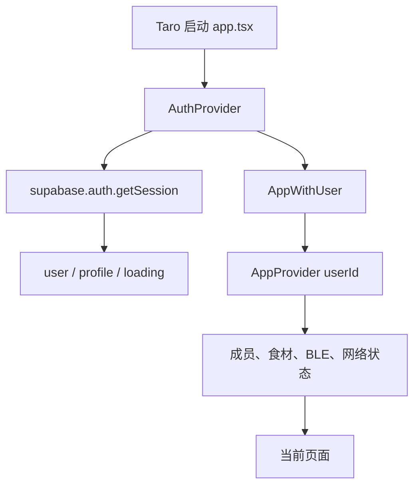
```mermaid
flowchart TD
  Boot["Taro 启动 app.tsx"] --> AuthProvider["AuthProvider"]
  AuthProvider --> Session["supabase.auth.getSession"]
  Session --> AuthState["user / profile / loading"]
  AuthProvider --> AppWithUser["AppWithUser"]
  AppWithUser --> AppProvider["AppProvider userId"]
  AppProvider --> RuntimeState["成员、食材、BLE、网络状态"]
  RuntimeState --> Page["当前页面"]
```

`AuthProvider` 必须位于 `AppProvider` 外层，因为 `AppProvider` 需要当前 `user.id` 来持久化激活家庭成员。页面鉴权不放在 `app.tsx`，而由每个受保护页面使用 `withRouteGuard` 包装。

## 6. 页面与访问控制矩阵

| 页面 | 路由 | 鉴权 | 主要职责 |
|---|---|---:|---|
| 首页 | `/pages/home/index` | 是 | BLE、食材、拍照识别、营养分析、称重历史 |
| AI 问答 | `/pages/chat/index` | 是 | 文本问答、TTS、按住说话、RTC 云端历史 |
| 统计 | `/pages/stats/index` | 是 | 日/周/月营养聚合和成员切换 |
| 我的 | `/pages/profile/index` | 是 | 个人入口、设备和设置摘要 |
| 设备管理 | `/pages/device-manager/index` | 是 | 已绑定设备、在线探测、解绑 |
| 添加设备 | `/pages/device-add/index` | 是 | 扫描、筛选、绑定 BLE 设备 |
| 个人信息 | `/pages/personal-info/index` | 是 | 主成员健康档案、头像、清理旧对话表 |
| 账号设置 | `/pages/account-settings/index` | 是 | 微信绑定状态、绑定和解绑 |
| 档案引导 | `/pages/profile-onboarding/index` | 是 | 新用户昵称/头像初始化 |
| 家庭成员 | `/pages/family/index` | 是 | 成员列表、切换、删除 |
| 成员编辑 | `/pages/family-edit/index` | 是 | 新增/编辑健康档案 |
| 菜谱 | `/pages/recipe/index` | 是 | AI 菜谱、海报、分享快照 |
| 菜谱分享 | `/pages/recipe-share/index` | 否 | 按分享 ID 读取公开快照 |
| 提醒设置 | `/pages/reminder-settings/index` | 是 | 订阅授权、一次性提醒预约 |
| 登录 | `/pages/login/index` | 否 | 用户名登录/注册、微信登录/绑定 |
| 用户协议 | `/pages/agreement/index` | 否 | 静态协议 |
| 隐私政策 | `/pages/privacy/index` | 否 | 静态隐私说明 |

TabBar 页面为首页、AI 问答、统计和我的。登录完成后的跳转会根据目标是否属于 TabBar，分别使用 `switchTab` 或 `redirectTo`。

## 7. 百度 BRTC 总体链路

### 7.1 调用拓扑

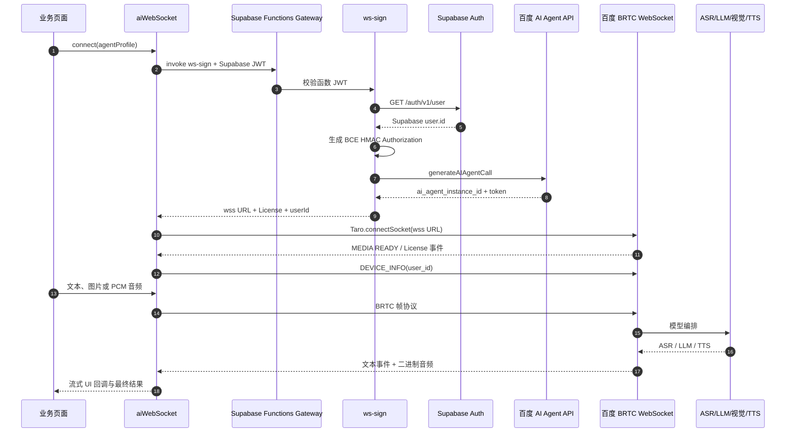
```mermaid
sequenceDiagram
  autonumber
  participant Page as 业务页面
  participant Client as aiWebSocket
  participant SB as Supabase Functions Gateway
  participant Sign as ws-sign
  participant Auth as Supabase Auth
  participant Agent as 百度 AI Agent API
  participant WS as 百度 BRTC WebSocket
  participant Model as ASR/LLM/视觉/TTS

  Page->>Client: connect(agentProfile)
  Client->>SB: invoke ws-sign + Supabase JWT
  SB->>Sign: 校验函数 JWT
  Sign->>Auth: GET /auth/v1/user
  Auth-->>Sign: Supabase user.id
  Sign->>Sign: 生成 BCE HMAC Authorization
  Sign->>Agent: generateAIAgentCall
  Agent-->>Sign: ai_agent_instance_id + token
  Sign-->>Client: wss URL + License + userId
  Client->>WS: Taro.connectSocket(wss URL)
  WS-->>Client: MEDIA READY / License 事件
  Client->>WS: DEVICE_INFO(user_id)
  Page->>Client: 文本、图片或 PCM 音频
  Client->>WS: BRTC 帧协议
  WS->>Model: 模型编排
  Model-->>WS: ASR / LLM / TTS
  WS-->>Client: 文本事件 + 二进制音频
  Client-->>Page: 流式 UI 回调与最终结果
```

### 7.2 服务端签名和 Agent 创建

`ws-sign` 是 BRTC 的唯一服务端入口，职责如下：

1. 从请求的 `Authorization` 读取 Supabase JWT。
2. 通过 `${SUPABASE_URL}/auth/v1/user` 获取可信的 Supabase UUID。
3. 根据 `agentProfile` 构建 AI Agent 配置。
4. 使用百度 BCE AK/SK 对 `POST /api/v1/aiagent/generateAIAgentCall` 生成 HMAC-SHA256 签名。
5. 获取 `ai_agent_instance_id` 和实例 token。
6. 生成 `wss://rtc-aiotgw.exp.bcelive.com/v1/realtime` URL。
7. 返回 License、设备 ID、profile 和 user ID。

前端传入的 `cfg`、`ac` 和 `mode` 目前不会影响服务端结果：

- `mode` 在客户端类型中固定为 `default`。
- `ac` 最终固定为 `raw16k`。
- `cfg` 不会合并进 Agent 配置。
- Agent 配置由 `ws-sign` 的默认值和 `BAIDU_RTC_AGENT_CONFIG` 完全托管。

### 7.3 Agent Profile

| Profile | 当前调用方 | 当前差异 |
|---|---|---|
| `chat` | 首页营养分析、聊天、菜谱 | 默认实时识别、LLM 和 TTS |
| `vision` | 首页拍照识别 | 当前配置层与 `chat` 相同，由图片事件协议触发视觉能力 |
| `voice-ptt` | AI 问答按住说话 | `asr_long_audio_mode=true`，配合长文本录音控制帧 |
| `voice-realtime` | 暂无页面调用 | 类型和服务端分支已预留，当前未形成独立配置 |

### 7.4 WebSocket 就绪状态机

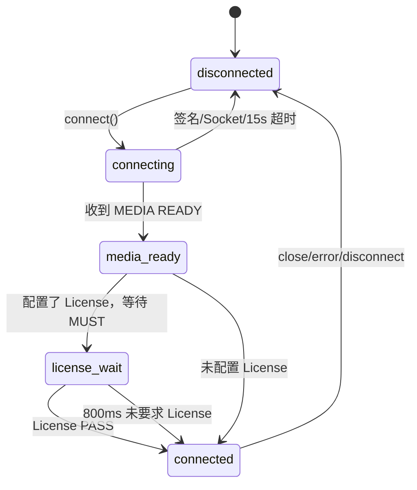
```mermaid
stateDiagram-v2
  [*] --> disconnected
  disconnected --> connecting: connect()
  connecting --> media_ready: 收到 MEDIA READY
  media_ready --> license_wait: 配置了 License，等待 MUST
  license_wait --> connected: License PASS
  license_wait --> connected: 800ms 未要求 License
  media_ready --> connected: 未配置 License
  connecting --> disconnected: 签名/Socket/15s 超时
  connected --> disconnected: close/error/disconnect
```

当前 License 校验失败时客户端会继续放行连接，以保证聊天可用。这属于可用性优先的降级策略，不等同于 License 已经有效；生产合规要求如果禁止该降级，需要修改状态机。

连接完成后客户端发送：

```text
[SET]:[DEVICE_INFO]:{"user_id":"<supabase-user-id>","userId":"<supabase-user-id>"}
```

这使 BRTC 云端 dialogues 能按同一个 Supabase UUID 查询，也是历史记录隔离的关键关联字段。

### 7.5 BRTC 消息协议映射

| 方向 | 帧或事件 | 客户端语义 |
|---|---|---|
| 上行 | `[T]:<text>` | 文本问题或图片上传后的最终 prompt |
| 上行 | PCM ArrayBuffer | `raw16k` 单声道语音数据 |
| 上行 | `[E]:[IMG]:<base64-frame>` | 16 KiB 图片分片 |
| 上行 | `[E]:[CMD]:[ASR_DISABLE_REALTIME]` | 关闭实时 ASR |
| 上行 | `[E]:[CMD]:[ASR_START_LONGTEXT_REC]` | 开始 PTT 长语音识别 |
| 上行 | `[E]:[CMD]:[ASR_STOP_LONGTEXT_REC]` | 结束 PTT 长语音识别 |
| 下行 | `[E]:[MEDIA]:[READY]` | 媒体通道就绪 |
| 下行 | `[E]:[LIC]:...` | License 要求与结果 |
| 下行 | `[E]:[UPLOAD_IMAGE]` | Agent 请求上传图片 |
| 下行 | `[Q]:[M]:...` | ASR 中间文本 |
| 下行 | `[Q]:...` | ASR 最终文本 |
| 下行 | `[A]:[M]:...` | LLM 中间文本 |
| 下行 | `[A]:...` | LLM 最终文本 |
| 下行 | `[E]:[TTS_BEGIN_SPEAKING]` | TTS 开始 |
| 下行 | `[E]:[TTS_END_SPEAKING]` | TTS 结束 |
| 下行 | 二进制 ArrayBuffer | PCM TTS 音频块 |

### 7.6 文本问答与流式 TTS

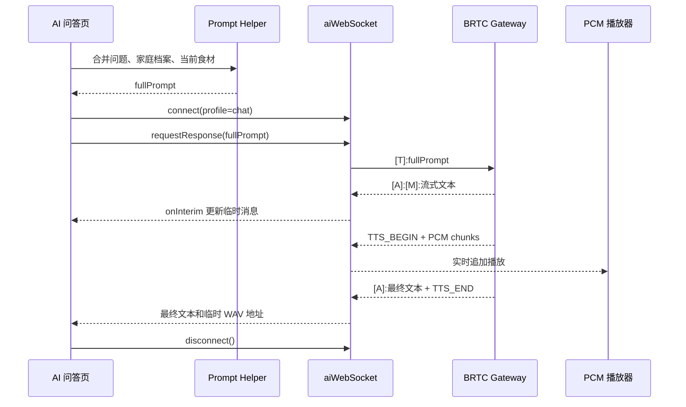
```mermaid
sequenceDiagram
  participant Chat as AI 问答页
  participant Prompt as Prompt Helper
  participant WS as aiWebSocket
  participant BRTC as BRTC Gateway
  participant Audio as PCM 播放器

  Chat->>Prompt: 合并问题、家庭档案、当前食材
  Prompt-->>Chat: fullPrompt
  Chat->>WS: connect(profile=chat)
  Chat->>WS: requestResponse(fullPrompt)
  WS->>BRTC: [T]:fullPrompt
  BRTC-->>WS: [A]:[M]:流式文本
  WS-->>Chat: onInterim 更新临时消息
  BRTC-->>WS: TTS_BEGIN + PCM chunks
  WS-->>Audio: 实时追加播放
  BRTC-->>WS: [A]:最终文本 + TTS_END
  WS-->>Chat: 最终文本和临时 WAV 地址
  Chat->>WS: disconnect()
```

当前聊天消息和 TTS 音频只保存在页面内存/本地临时文件中；历史抽屉以百度 RTC dialogues 为准，并不会从 `chat_messages` 回放音频。

超时行为：

- 默认最终响应超时为 30 秒。
- 已收到 LLM interim 时，超时会使用累计中间文本作为结果。
- 已收到 final 但仍等待 TTS 时，无 TTS 起始事件最多等待 6 秒；已起始但无音频最多等待 15 秒。
- 收到音频或 TTS 结束后，等待 1.2 秒尾部音频空闲再完成。

### 7.7 图片识别与图片持久化

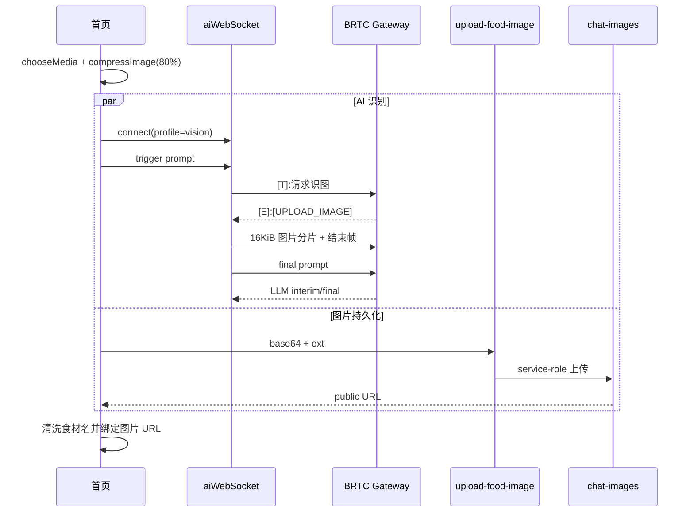
```mermaid
sequenceDiagram
  participant Home as 首页
  participant WS as aiWebSocket
  participant BRTC as BRTC Gateway
  participant Upload as upload-food-image
  participant Storage as chat-images

  Home->>Home: chooseMedia + compressImage(80%)
  par AI 识别
    Home->>WS: connect(profile=vision)
    Home->>WS: trigger prompt
    WS->>BRTC: [T]:请求识图
    BRTC-->>WS: [E]:[UPLOAD_IMAGE]
    WS->>BRTC: 16KiB 图片分片 + 结束帧
    WS->>BRTC: final prompt
    BRTC-->>WS: LLM interim/final
  and 图片持久化
    Home->>Upload: base64 + ext
    Upload->>Storage: service-role 上传
    Storage-->>Home: public URL
  end
  Home->>Home: 清洗食材名并绑定图片 URL
```

两个分支通过 `Promise.allSettled` 并行执行。识别成功但 Storage 上传失败时，食材仍可添加，只显示本机临时图片；识别失败则整个识别操作失败。

### 7.8 按住说话 ASR

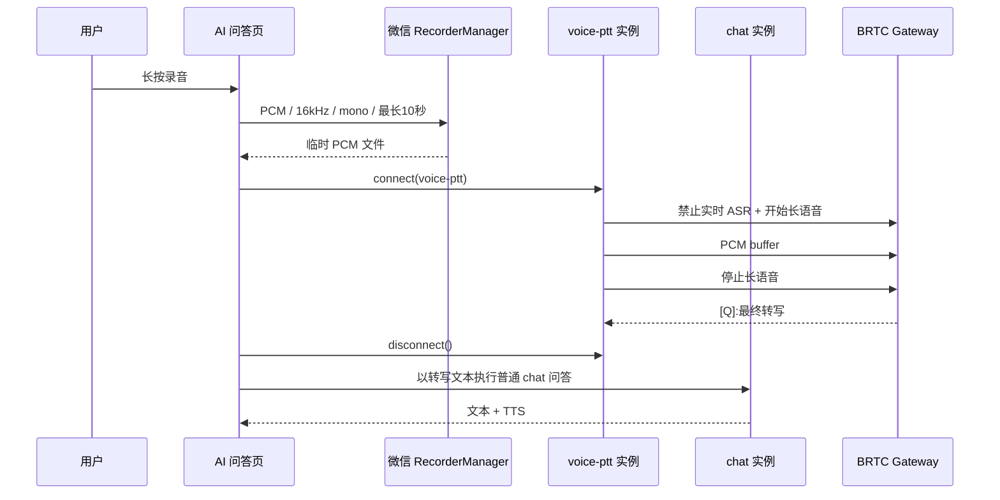
```mermaid
sequenceDiagram
  participant User as 用户
  participant Chat as AI 问答页
  participant Recorder as 微信 RecorderManager
  participant WS1 as voice-ptt 实例
  participant WS2 as chat 实例
  participant BRTC as BRTC Gateway

  User->>Chat: 长按录音
  Chat->>Recorder: PCM / 16kHz / mono / 最长10秒
  Recorder-->>Chat: 临时 PCM 文件
  Chat->>WS1: connect(voice-ptt)
  WS1->>BRTC: 禁止实时 ASR + 开始长语音
  WS1->>BRTC: PCM buffer
  WS1->>BRTC: 停止长语音
  BRTC-->>WS1: [Q]:最终转写
  Chat->>WS1: disconnect()
  Chat->>WS2: 以转写文本执行普通 chat 问答
  WS2-->>Chat: 文本 + TTS
```

ASR 和回答使用两个连续的 BRTC Agent 实例。ASR 最终结果等待 15 秒；录音小于最小时长会在客户端直接拒绝。

### 7.9 RTC 云端历史

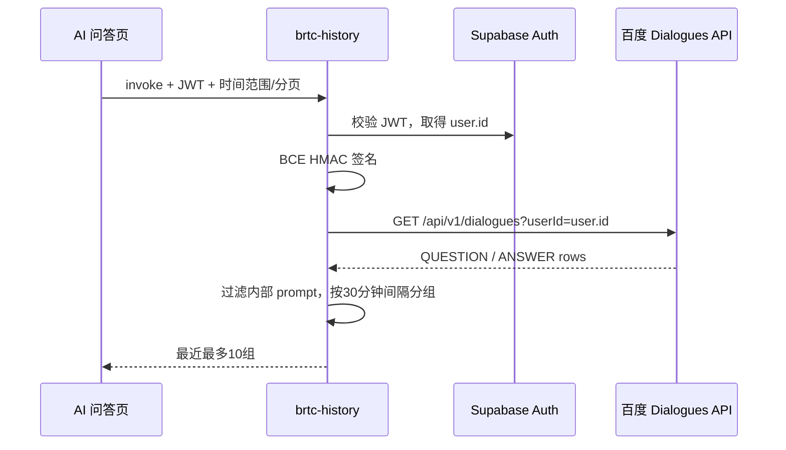
```mermaid
sequenceDiagram
  participant Chat as AI 问答页
  participant EF as brtc-history
  participant Auth as Supabase Auth
  participant API as 百度 Dialogues API

  Chat->>EF: invoke + JWT + 时间范围/分页
  EF->>Auth: 校验 JWT，取得 user.id
  EF->>EF: BCE HMAC 签名
  EF->>API: GET /api/v1/dialogues?userId=user.id
  API-->>EF: QUESTION / ANSWER rows
  EF->>EF: 过滤内部 prompt，按30分钟间隔分组
  EF-->>Chat: 最近最多10组
```

默认参数和降级策略：

- 默认查询最近 30 天、每页 100 行、最多返回 10 组。
- 相邻消息间隔超过 30 分钟时拆成新会话组。
- Supabase 鉴权超时为 5 秒，百度历史接口超时为 8 秒。
- 404、502、504、网络失败或显式超时会在客户端降级为空历史，不阻塞聊天主流程。
- 内部营养分析、图片识别等 prompt 会按规则隐藏，其紧随回答也可能一起过滤。

## 8. 登录、身份和路由保护

### 8.1 身份模型

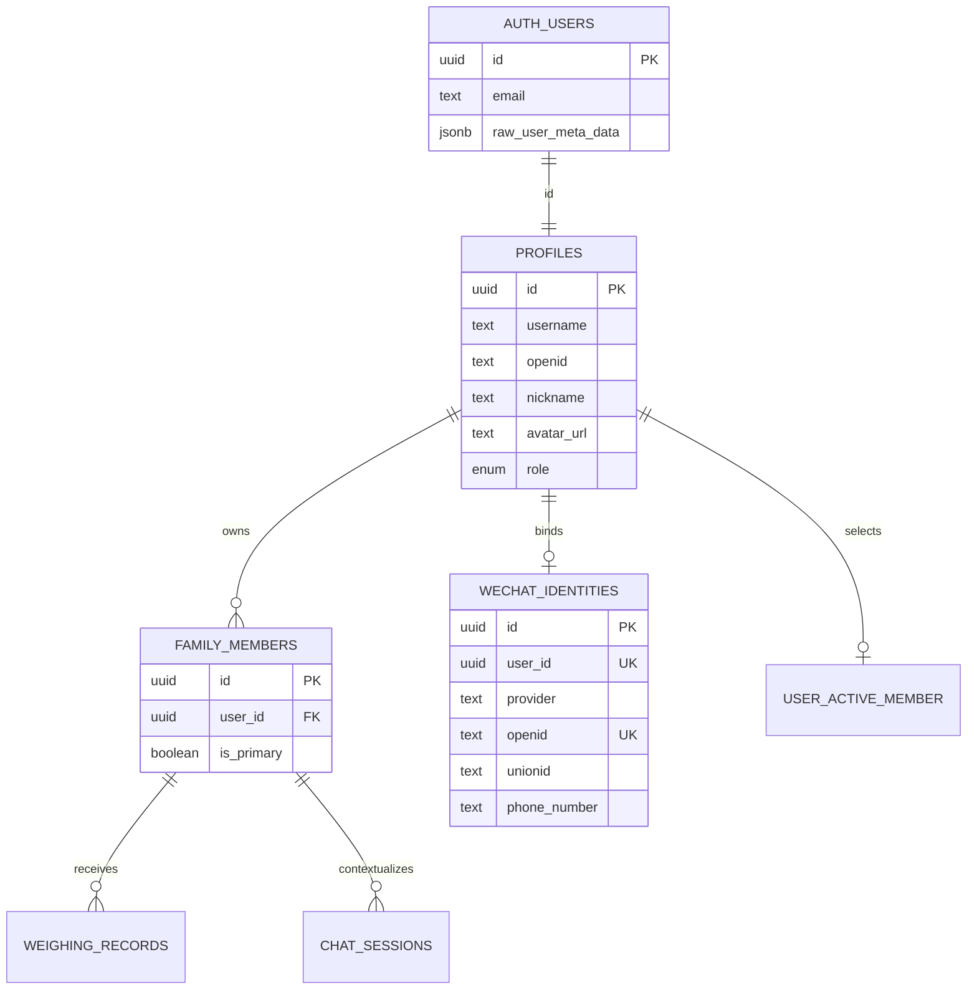
```mermaid
erDiagram
  AUTH_USERS ||--|| PROFILES : "id"
  PROFILES ||--o{ FAMILY_MEMBERS : owns
  PROFILES ||--o| WECHAT_IDENTITIES : binds
  PROFILES ||--o| USER_ACTIVE_MEMBER : selects
  FAMILY_MEMBERS ||--o{ WEIGHING_RECORDS : receives
  FAMILY_MEMBERS ||--o{ CHAT_SESSIONS : contextualizes

  AUTH_USERS {
    uuid id PK
    text email
    jsonb raw_user_meta_data
  }
  PROFILES {
    uuid id PK
    text username
    text openid
    text nickname
    text avatar_url
    enum role
  }
  WECHAT_IDENTITIES {
    uuid id PK
    uuid user_id UK
    text provider
    text openid UK
    text unionid
    text phone_number
  }
  FAMILY_MEMBERS {
    uuid id PK
    uuid user_id FK
    boolean is_primary
  }
```

Supabase Auth 用户是登录主体；`profiles` 是一对一业务档案；`family_members` 表示参与健康管理的家庭成员；`wechat_identities` 把一个微信 openid 绑定到一个 Auth 用户。

`profiles.openid` 为兼容旧数据保留，新的身份唯一性和绑定关系以 `wechat_identities(provider, openid)` 与 `wechat_identities(provider, user_id)` 为准。

### 8.2 用户名注册与登录

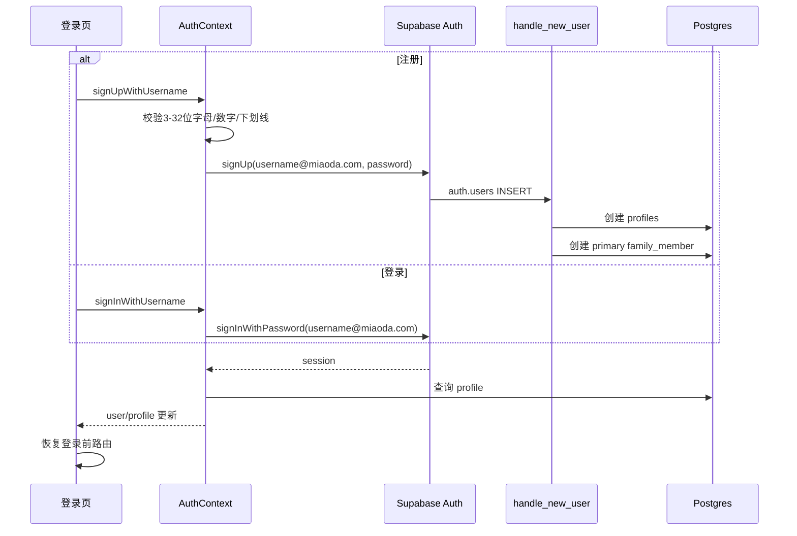
```mermaid
sequenceDiagram
  participant Page as 登录页
  participant Context as AuthContext
  participant Auth as Supabase Auth
  participant Trigger as handle_new_user
  participant DB as Postgres

  alt 注册
    Page->>Context: signUpWithUsername
    Context->>Context: 校验3-32位字母/数字/下划线
    Context->>Auth: signUp(username@miaoda.com, password)
    Auth->>Trigger: auth.users INSERT
    Trigger->>DB: 创建 profiles
    Trigger->>DB: 创建 primary family_member
  else 登录
    Page->>Context: signInWithUsername
    Context->>Auth: signInWithPassword(username@miaoda.com)
  end
  Auth-->>Context: session
  Context->>DB: 查询 profile
  Context-->>Page: user/profile 更新
  Page->>Page: 恢复登录前路由
```

用户名在客户端规范化为小写并映射为内部邮箱 `<username>@miaoda.com`。密码最小长度由页面要求为 6；解绑微信时服务端接受 6 到 72 位。

### 8.3 微信登录与账号绑定

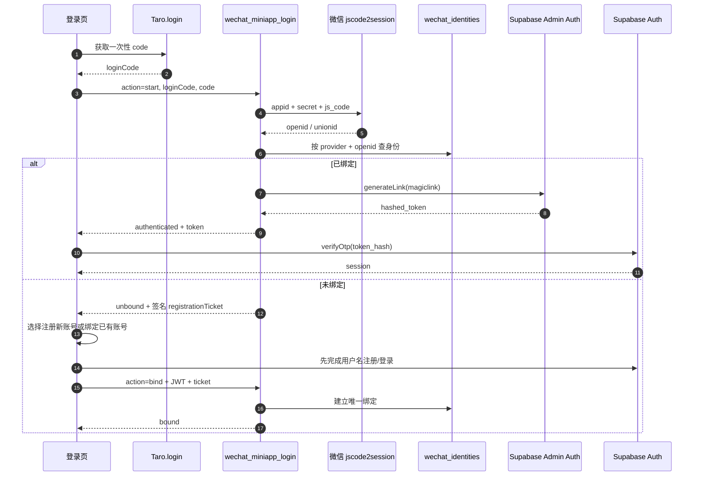
```mermaid
sequenceDiagram
  autonumber
  participant Page as 登录页
  participant Taro as Taro.login
  participant EF as wechat_miniapp_login
  participant WX as 微信 jscode2session
  participant DB as wechat_identities
  participant Admin as Supabase Admin Auth
  participant Auth as Supabase Auth

  Page->>Taro: 获取一次性 code
  Taro-->>Page: loginCode
  Page->>EF: action=start, loginCode, code
  EF->>WX: appid + secret + js_code
  WX-->>EF: openid / unionid
  EF->>DB: 按 provider + openid 查身份
  alt 已绑定
    EF->>Admin: generateLink(magiclink)
    Admin-->>EF: hashed_token
    EF-->>Page: authenticated + token
    Page->>Auth: verifyOtp(token_hash)
    Auth-->>Page: session
  else 未绑定
    EF-->>Page: unbound + 签名 registrationTicket
    Page->>Page: 选择注册新账号或绑定已有账号
    Page->>Auth: 先完成用户名注册/登录
    Page->>EF: action=bind + JWT + ticket
    EF->>DB: 建立唯一绑定
    EF-->>Page: bound
  end
```

当前新流程不会直接创建“仅微信账号”。未绑定微信必须先注册用户名账号或登录已有账号，然后绑定微信。服务端仍保留旧协议：请求体只有 `code` 时会创建 `wx_<hash>@wechat.login` 用户；这是兼容路径，不应作为新客户端流程使用。

`registrationTicket` 使用 `WECHAT_LOGIN_TICKET_SECRET` 签名，包含 openid、可选 unionid 和过期时间。它不是登录 Session，只有在用户已经持有有效 Supabase JWT 后才能执行 `bind`。

### 8.4 微信绑定、状态和解绑

| 动作 | 客户端函数 | 服务端 action | 授权与约束 |
|---|---|---|---|
| 登录探测 | `startWechatLogin` | `start` | 微信 code；已绑定时返回 magiclink token |
| 准备绑定 | `prepareWechatBinding` | `prepare-bind` | 必须 JWT；拒绝绑定到其他账号的微信 |
| 执行绑定 | `bindWechatAccount` | `bind` | 必须 JWT + 有效 ticket；账号和微信均一对一 |
| 查询状态 | `getWechatAccountStatus` | `status` | 必须 JWT |
| 解绑 | `unbindWechatAccount` | `unbind` | 必须 JWT、用户名密码账号、再次验证密码 |

旧版 `@wechat.login` 用户没有用户名密码时不能直接解绑，必须先完成账号迁移。解绑会同时清理 `profiles.openid` 和 `wechat_identities` 记录。

### 8.5 Session 持久化

Supabase Client 使用 Taro 同步 Storage 包装成异步 storage adapter：

- Storage key：`${TARO_APP_APP_ID}-auth-token`。
- `persistSession=true`。
- `autoRefreshToken=true`。
- `detectSessionInUrl=false`。
- 启动时 `getSession()` 恢复用户。
- `onAuthStateChange` 同步登录、刷新和退出状态。

更换 `TARO_APP_APP_ID` 会改变本地 Session key，用户会表现为重新登录。清理小程序缓存也会移除 Session。

### 8.6 路由保护和登录后恢复

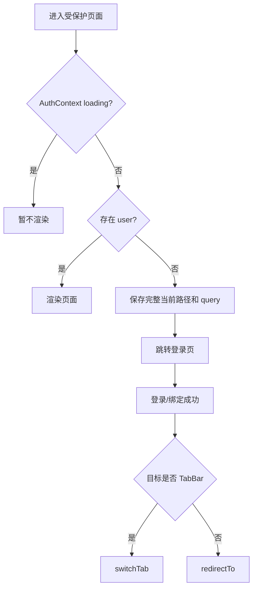
```mermaid
flowchart TD
  Enter["进入受保护页面"] --> Loading{"AuthContext loading?"}
  Loading -->|是| Blank["暂不渲染"]
  Loading -->|否| User{"存在 user?"}
  User -->|是| Render["渲染页面"]
  User -->|否| Save["保存完整当前路径和 query"]
  Save --> Login["跳转登录页"]
  Login --> Success["登录/绑定成功"]
  Success --> Target{"目标是否 TabBar"}
  Target -->|是| Switch["switchTab"]
  Target -->|否| Redirect["redirectTo"]
```

公开页面只有登录页和菜谱分享页；协议与隐私页未套 `withRouteGuard`，因此实际也是公开页面。路由守卫的公开名单只参与被包装页面判断，不是全局路由注册表。

## 9. 业务模块架构

### 9.1 首页、称重和营养分析

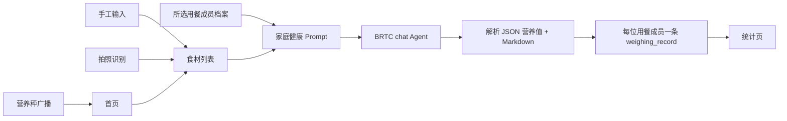
```mermaid
flowchart LR
  BLE["营养秤广播"] --> Home["首页"]
  Manual["手工输入"] --> Ingredients["食材列表"]
  Camera["拍照识别"] --> Ingredients
  Home --> Ingredients
  Members["所选用餐成员档案"] --> Prompt["家庭健康 Prompt"]
  Ingredients --> Prompt
  Prompt --> BRTC["BRTC chat Agent"]
  BRTC --> Parse["解析 JSON 营养值 + Markdown"]
  Parse --> Records["每位用餐成员一条 weighing_record"]
  Records --> Stats["统计页"]
```

关键规则：

- 只有免责声明已确认后首页才初始化 BLE，避免隐私说明弹窗与系统权限弹窗冲突。
- 食材重量优先使用当前 BLE 重量；未连接时使用手工重量。
- 过敏源匹配在客户端完成，并基于所有所选用餐成员汇总预警。
- AI 先返回整餐营养 JSON，客户端再按用餐人数平摊后为每名成员写一条记录。
- 写入完成后触发 `NUTRITION_RECORDS_UPDATED`，统计页据此重新加载。
- `analysis_result` 保存清理后的 Markdown，结构化营养字段保存人均值。

### 9.2 BLE 设备链路

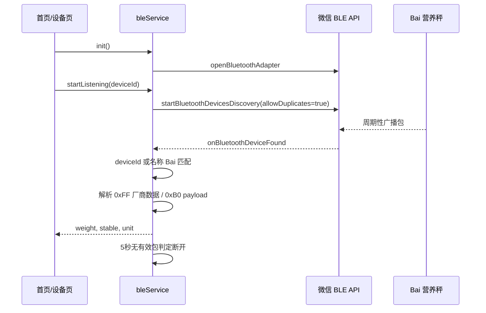
```mermaid
sequenceDiagram
  participant Page as 首页/设备页
  participant BLE as bleService
  participant WX as 微信 BLE API
  participant Scale as Bai 营养秤

  Page->>BLE: init()
  BLE->>WX: openBluetoothAdapter
  Page->>BLE: startListening(deviceId)
  BLE->>WX: startBluetoothDevicesDiscovery(allowDuplicates=true)
  Scale-->>WX: 周期性广播包
  WX-->>BLE: onBluetoothDeviceFound
  BLE->>BLE: deviceId 或名称 Bai 匹配
  BLE->>BLE: 解析 0xFF 厂商数据 / 0xB0 payload
  BLE-->>Page: weight, stable, unit
  BLE->>BLE: 5秒无有效包判定断开
```

当前“连接”是持续接收到目标广播的逻辑状态，不调用 `createBLEConnection`，也不建立 GATT 会话。数据格式为 6 字节 payload：厂商标识、流水号、24 位大端重量和属性位；属性位包含正负号、单位、小数位和稳定状态。v2.2 协议没有电量字段，`battery_level` 和回调仅为兼容保留。

添加设备时只接受名称精确为 `Bai` 的设备；RSSI 大于 `-60` dBm 被视为强信号。监听时除了已保存 device ID，也允许按名称回退匹配，以适配 MAC 随机化或平台 ID 差异。

### 9.3 AI 问答模块

AI 问答页是 BRTC 多模态交互聚合层：

- 可选择是否把家庭成员健康档案加入 prompt。
- 可选择是否把当前称重食材加入 prompt。
- 普通文字问答返回流式文本和实时 PCM TTS。
- 按住说话先走 `voice-ptt` ASR，再走 `chat` 回答。
- 当前 UI 消息是内存对象；页面销毁后依靠百度 RTC 历史恢复文本。
- 中断当前回答会断开对应 WebSocket 实例，避免旧事件污染下一次请求。

`chat_sessions`、`chat_messages` 的 CRUD 和表结构仍保留，但当前 `sendMessage` 使用本地临时 ID，不再写入这两张表。个人信息页中的“清理对话”只删除 Supabase 旧会话表，不会删除百度 RTC dialogues。

### 9.4 家庭成员与健康档案

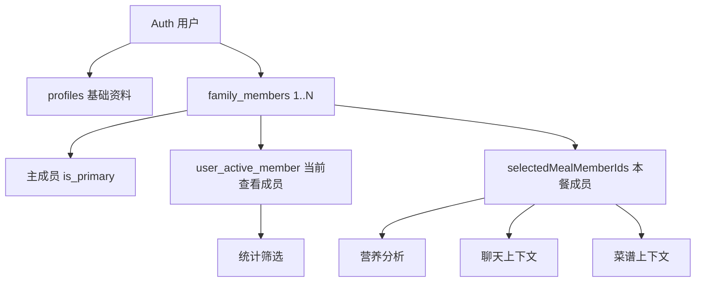
```mermaid
flowchart TD
  AuthUser["Auth 用户"] --> Profile["profiles 基础资料"]
  AuthUser --> Members["family_members 1..N"]
  Members --> Primary["主成员 is_primary"]
  Members --> Active["user_active_member 当前查看成员"]
  Members --> Meal["selectedMealMemberIds 本餐成员"]
  Active --> Stats["统计筛选"]
  Meal --> HomeAI["营养分析"]
  Meal --> ChatAI["聊天上下文"]
  Meal --> RecipeAI["菜谱上下文"]
```

`activeMember` 是跨页面的当前查看成员，持久化到 `user_active_member`；`selectedMealMemberIds` 是本次用餐范围，只存在客户端状态。选择的本餐成员数量会自动同步为 `personCount`。

健康档案包括性别、年龄、身高、体重、生日、血型、慢性病、过敏源、用药和四类每日营养目标。敏感健康字段会进入 BRTC prompt，因此日志、历史和外部模型数据治理必须覆盖这些内容。

### 9.5 设备管理模块

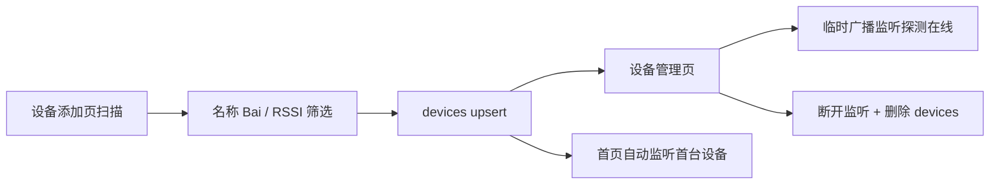
```mermaid
flowchart LR
  Add["设备添加页扫描"] --> Filter["名称 Bai / RSSI 筛选"]
  Filter --> Save["devices upsert"]
  Save --> Manage["设备管理页"]
  Manage --> Probe["临时广播监听探测在线"]
  Manage --> Delete["断开监听 + 删除 devices"]
  Save --> Home["首页自动监听首台设备"]
```

数据库保存的是设备绑定信息，不代表实时连接。`devices.is_connected` 当前不是广播状态的可靠事实来源；实时状态由 `bleService` 内存状态和 5 秒心跳判断。

### 9.6 营养统计模块

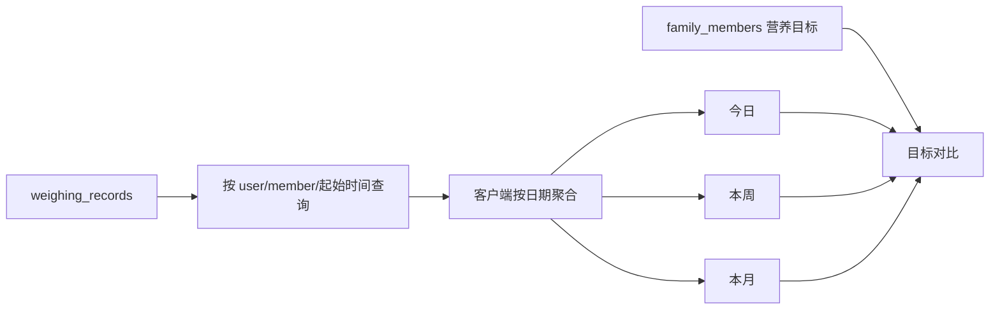
```mermaid
flowchart LR
  Records["weighing_records"] --> Query["按 user/member/起始时间查询"]
  Query --> Aggregate["客户端按日期聚合"]
  Aggregate --> Day["今日"]
  Aggregate --> Week["本周"]
  Aggregate --> Month["本月"]
  Goals["family_members 营养目标"] --> View["目标对比"]
  Day --> View
  Week --> View
  Month --> View
```

当前没有独立报表服务、数据库聚合 RPC 或物化视图。`getNutritionStats` 拉取时间范围内的记录后在客户端按 `created_at` 日期字符串聚合。数据量增长后应考虑分页和服务端聚合。

### 9.7 菜谱生成与分享

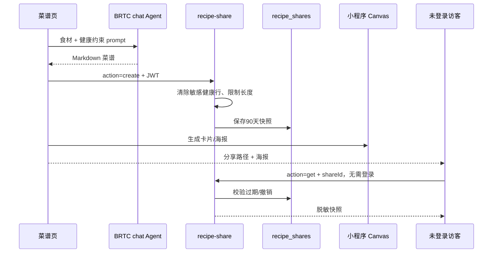
```mermaid
sequenceDiagram
  participant Page as 菜谱页
  participant BRTC as BRTC chat Agent
  participant Share as recipe-share
  participant DB as recipe_shares
  participant Canvas as 小程序 Canvas
  participant Guest as 未登录访客

  Page->>BRTC: 食材 + 健康约束 prompt
  BRTC-->>Page: Markdown 菜谱
  Page->>Share: action=create + JWT
  Share->>Share: 清除敏感健康行、限制长度
  Share->>DB: 保存90天快照
  Page->>Canvas: 生成卡片/海报
  Page-->>Guest: 分享路径 + 海报
  Guest->>Share: action=get + shareId，无需登录
  Share->>DB: 校验过期/撤销
  Share-->>Guest: 脱敏快照
```

`recipe-share` 在 `supabase/config.toml` 中关闭平台 JWT 强校验，以允许公开读取；函数内部仅对 `create` 强制校验用户，对 `get` 按 share ID 公开读取。分享默认 90 天过期。

### 9.8 微信一次性提醒

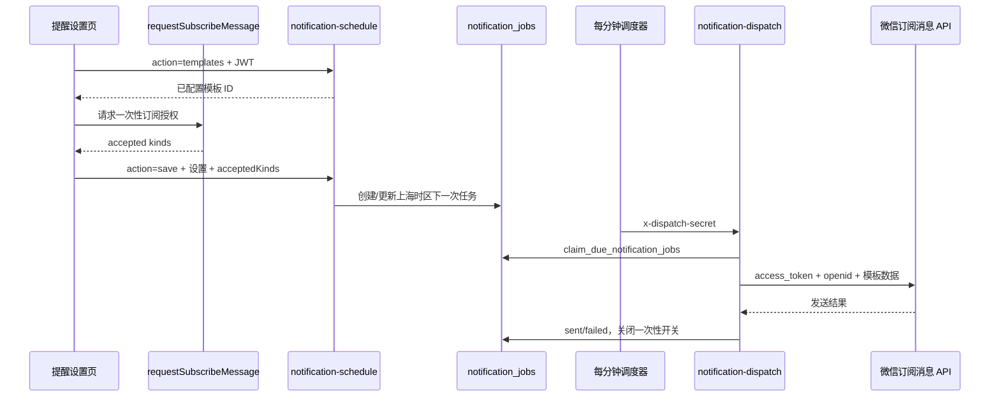
```mermaid
sequenceDiagram
  participant Page as 提醒设置页
  participant WXClient as requestSubscribeMessage
  participant Schedule as notification-schedule
  participant DB as notification_jobs
  participant Cron as 每分钟调度器
  participant Dispatch as notification-dispatch
  participant WXAPI as 微信订阅消息 API

  Page->>Schedule: action=templates + JWT
  Schedule-->>Page: 已配置模板 ID
  Page->>WXClient: 请求一次性订阅授权
  WXClient-->>Page: accepted kinds
  Page->>Schedule: action=save + 设置 + acceptedKinds
  Schedule->>DB: 创建/更新上海时区下一次任务
  Cron->>Dispatch: x-dispatch-secret
  Dispatch->>DB: claim_due_notification_jobs
  Dispatch->>WXAPI: access_token + openid + 模板数据
  WXAPI-->>Dispatch: 发送结果
  Dispatch->>DB: sent/failed，关闭一次性开关
```

任务以 `Asia/Shanghai` 计算下一次发生时间。领取使用 `FOR UPDATE SKIP LOCKED`，处理中断超过 5 分钟可重领，最多尝试 3 次。成功或达到最大尝试次数后，对应 reminder 开关自动关闭。

### 9.9 头像和食材图片

| 能力 | Edge Function | Bucket | 鉴权 | 对象路径 |
|---|---|---|---|---|
| 头像 | `upload-avatar` | `avatars` | JWT + 函数内用户校验 | `<userId>/<uuid>.<ext>` |
| 食材图片 | `upload-food-image` | `chat-images` | 依赖 Functions 网关默认 JWT | `food-images/<timestamp>-<random>.<ext>` |

两个 bucket 当前都是公开读。头像限制 2 MiB；`chat-images` bucket 配置限制 5 MiB，但 `upload-food-image` 自身没有显式文件大小上限。食材图片路径不含用户 ID，函数也没有二次 `getAuthUserId` 校验，这是当前需要重点关注的安全与配额风险。

`generated-audio` bucket 和相关策略仍存在，但当前聊天 TTS 使用本地临时 WAV，不上传该 bucket。

## 10. Edge Functions 清单

| Function | 平台 `verify_jwt` | 函数内授权 | 下游依赖 | 主要数据 |
|---|---:|---|---|---|
| `ws-sign` | 默认开启 | 再次请求 Supabase `/auth/v1/user` | 百度 Agent API | 不落库 |
| `brtc-history` | 默认开启 | 再次请求 Supabase `/auth/v1/user` | 百度 Dialogues API | 不落库 |
| `upload-food-image` | 默认开启 | 无二次用户校验 | Supabase Storage REST | `chat-images` |
| `upload-avatar` | 默认开启 | `getAuthUserId` | Supabase Storage | `avatars` |
| `wechat_miniapp_login` | 关闭 | 按 action 使用 code、ticket 或 JWT | 微信登录、Supabase Admin | 身份表、profile |
| `wechat-notification-schedule` | 默认开启 | `getAuthUserId` | Supabase Admin | 设置、任务 |
| `wechat-notification-dispatch` | 关闭 | `x-dispatch-secret` | 微信消息 API | 任务、设置、token 缓存 |
| `recipe-share` | 关闭 | create 校验 JWT，get 公开 | Supabase Admin | 分享快照 |

“默认开启”表示仓库 `supabase/config.toml` 没有将该函数设置为 `verify_jwt=false`。部署时必须确认云端配置与仓库一致，不能只根据函数内部代码推断。

## 11. 数据架构

### 11.1 业务数据关系

```mermaid
erDiagram
  PROFILES ||--o{ FAMILY_MEMBERS : owns
  PROFILES ||--o| USER_ACTIVE_MEMBER : selects
  FAMILY_MEMBERS ||--o{ WEIGHING_RECORDS : receives
  PROFILES ||--o{ DEVICES : binds
  PROFILES ||--o{ CHAT_SESSIONS : owns
  CHAT_SESSIONS ||--o{ CHAT_MESSAGES : contains
  PROFILES ||--o| REMINDER_SETTINGS : configures
  PROFILES ||--o| WECHAT_IDENTITIES : binds
  PROFILES ||--o{ NOTIFICATION_JOBS : schedules
  PROFILES ||--o{ RECIPE_SHARES : owns
  WECHAT_ACCESS_TOKENS ||--|| WECHAT_PLATFORM : caches
```

### 11.2 表职责与当前使用状态

| 表 | 职责 | 客户端直连 | 当前状态 |
|---|---|---:|---|
| `profiles` | 业务用户资料、角色、引导标记 | 是 | 主链路 |
| `family_members` | 家庭健康档案 | 是 | 主链路 |
| `user_active_member` | 当前查看成员 | 是 | 主链路 |
| `devices` | BLE 设备绑定 | 是 | 主链路 |
| `weighing_records` | 营养分析和统计记录 | 是 | 主链路 |
| `chat_sessions` | 旧版本地聊天会话 | 是 | 表和 API 保留，当前发送链路不写入 |
| `chat_messages` | 旧版本地聊天消息 | 是 | 表和 API 保留，当前发送链路不写入 |
| `reminder_settings` | 提醒设置与一次性开关 | 客户端读，函数写 | 主链路 |
| `wechat_identities` | 微信与 Auth 用户一对一映射 | 否 | Edge Function 主链路 |
| `wechat_access_tokens` | 微信 access token 缓存 | 否 | Edge Function 主链路 |
| `notification_jobs` | 一次性通知任务 | 否 | Edge Function 主链路 |
| `recipe_shares` | 脱敏菜谱分享快照 | 否 | Edge Function 主链路 |

### 11.3 RLS 和服务角色

- `profiles`、成员、设备、称重、旧聊天和提醒设置都启用 RLS。
- 普通用户通过 `auth.uid()` 只能操作自己的数据。
- `chat_messages` 通过所属 `chat_sessions.user_id` 间接授权。
- `profiles` 的管理员策略预留了 `admin` 完整权限；普通用户更新时不能提升自身角色。
- 微信身份、token、通知任务和菜谱分享不向 anon/authenticated 创建表策略，只允许 service role 通过 Edge Functions 访问。
- `claim_due_notification_jobs` 是 `SECURITY DEFINER` RPC，仅授予 service role。

### 11.4 Realtime

迁移把 `weighing_records` 和 `chat_messages` 加入 `supabase_realtime` publication。当前统计页主要通过客户端事件 `NUTRITION_RECORDS_UPDATED` 刷新；若后续启用跨设备实时刷新，可复用数据库 Realtime，但需要同时核验订阅清理和 RLS。

## 12. 环境变量与密钥配置

### 12.1 配置分层原则

| 配置层 | 存放位置 | 是否可进入小程序包 |
|---|---|---:|
| 前端公开配置 | `.env*` / CI 构建变量 | 是 |
| Supabase 内置变量 | Edge Functions 运行环境 | 否 |
| 百度凭据与 Agent 配置 | Supabase Secrets | 否 |
| 微信 AppSecret、ticket、调度密钥 | Supabase Secrets | 否 |
| 微信 AppID | 前端构建变量 + 微信后台；服务端另配登录 AppID | 前端 AppID 可公开，AppSecret 不可 |

任何包含 `SK`、`SECRET`、`SERVICE_ROLE`、完整 License Key 或短期 BRTC URL 的值都不得写入仓库、客户端日志、截图或工单正文。

### 12.2 前端构建变量

| 变量 | 必需 | 当前使用位置 | 说明 |
|---|---:|---|---|
| `TARO_APP_SUPABASE_URL` | 是 | `src/client/supabase.ts` | Supabase 项目 URL，同时属于微信 request 合法域名 |
| `TARO_APP_SUPABASE_ANON_KEY` | 是 | `src/client/supabase.ts` | 公开 anon key；不能替换为 service role |
| `TARO_APP_APP_ID` | 是 | Supabase storage key、开发监控 | 应与微信小程序 AppID/环境规划一致 |
| `TARO_APP_SHOW_PRIVACY_SCOPE_MODAL` | 否 | `config/index.ts` | 编译期隐私提示开关，默认 `false` |
| `TARO_APP_API` | 当前未用 | `.env.development` | 源码没有业务引用，属于模板遗留 |
| `VITE_SUPABASE_PROXY` | 当前未用 | `.env` | 源码没有业务引用，属于模板遗留 |

Taro 只有符合其变量注入规则的构建变量才能进入客户端。`.env.production` 和 `.env.test` 当前没有已识别键，生产构建必须由 CI 或部署环境提供前三个必需变量。

### 12.3 构建与开发变量

| 变量 | 必需 | 默认值/用途 |
|---|---:|---|
| `TARO_ENV` | 工具注入 | `weapp` 时使用微信 Supabase polyfill，`h5` 时使用官方 SDK |
| `NODE_ENV` | 工具注入 | `development` 加载开发插件，否则加载生产配置 |
| `LINT_MODE` | 否 | `true` 时使用 lint 构建配置 |
| `INJECT_SENTRY_DSN` | 否 | 开发监控插件 DSN |
| `MIAODA_ENV` | 否 | 开发监控环境名 |
| `MIAODA_CDN_HOST` | 否 | 开发监控脚本 CDN，默认 `resource-static.cdn.bcebos.com` |
| `RTC_HISTORY_TEST_GAP_SECONDS` | 仅 E2E | RTC 历史端到端脚本的分组间隔，默认 `1800` 秒，不进入应用运行时 |

### 12.4 Supabase 服务变量

| 变量 | 必需 | 使用方 | 说明 |
|---|---:|---|---|
| `SUPABASE_URL` | 是，平台通常自动注入 | 所有服务端函数 | 项目 URL |
| `SUPABASE_ANON_KEY` | 是，平台通常自动注入 | `ws-sign`、`brtc-history`、登录密码复验 | Auth 用户校验 |
| `SUPABASE_SERVICE_ROLE_KEY` | 是，平台通常自动注入 | `_shared/common`、上传和业务函数 | 绕过 RLS，最高敏感级别 |
| `APP_SUPABASE_URL` | 条件可选 | 所有服务端函数 | 自定义覆盖 `SUPABASE_URL` |
| `APP_SUPABASE_ANON_KEY` | 条件可选 | BRTC/登录函数 | 自定义覆盖 anon key |
| `APP_SUPABASE_SERVICE_ROLE_KEY` | 条件可选 | Admin 函数 | 自定义覆盖 service-role key |

如果配置了 `APP_*`，代码会优先使用它们。运维必须避免 URL 来自项目 A、key 来自项目 B 的混配。

### 12.5 百度 BRTC 必需变量

| 变量 | 必需 | 默认/兼容 | 作用 |
|---|---:|---|---|
| `BAIDU_BCE_AK` | 是 | 回退 `BAIDU_BRTC_AK` | BCE API Access Key |
| `BAIDU_BCE_SK` | 是 | 回退 `BAIDU_BRTC_SK` | BCE API Secret Key |
| `BAIDU_BRTC_APPID` | 是 | 源码存在固定 fallback | BRTC 应用 ID，创建 Agent、建连和历史查询必须一致 |
| `BAIDU_BRTC_LICENSE_KEY` | 视账号要求 | 空值时跳过激活 | BRTC License |
| `BAIDU_BRTC_LICENSE_DEVICE_ID` | 建议显式配置 | 源码存在测试风格 fallback | License 设备标识 |

虽然 `BAIDU_BRTC_APPID` 和设备 ID 有源码 fallback，生产环境仍应显式设置，避免跨环境复用测试配置。

### 12.6 百度 Agent 可调变量

| 变量 | 默认值 | 作用 |
|---|---|---|
| `BAIDU_RTC_AGENT_PROMPT` | 内置健康顾问系统提示 | 全局角色 prompt |
| `BAIDU_RTC_AGENT_ROLE_NAME` | `智能健康顾问` | 场景角色名 |
| `BAIDU_RTC_AGENT_MODEL` | `DEFAULT` | 百度 Agent 模型标识 |
| `BAIDU_RTC_AGENT_ASR_VAD_MS` | `300` | VAD 参数 |
| `BAIDU_RTC_AGENT_ASR_VAD_WAIT_MS` | `800` | VAD 等待参数 |
| `BAIDU_RTC_AGENT_TTS_END_DELAY_MS` | `120` | TTS 结束延迟 |
| `BAIDU_RTC_AGENT_CONFIG` | `{}` | JSON 对象，最后浅合并并覆盖默认顶层字段 |

`BAIDU_RTC_AGENT_CONFIG` 是浅合并。若覆盖 `sceneRoleCfg`，必须提供完整对象，否则会整体替换默认的 name/prompt/model 子对象。

### 12.7 微信服务端变量

| 变量 | 必需 | 使用方 | 要求 |
|---|---:|---|---|
| `WECHAT_MINIPROGRAM_LOGIN_APP_ID` | 是 | 登录、access token | 必须与发起 `Taro.login` 的小程序一致 |
| `WECHAT_MINIPROGRAM_LOGIN_APP_SECRET` | 是 | 登录、access token | 只存 Supabase Secrets |
| `WECHAT_LOGIN_TICKET_SECRET` | 是 | 登录 ticket | 至少 32 个随机字符；轮换会使未完成绑定 ticket 失效 |
| `WECHAT_SUBSCRIBE_TEMPLATES_JSON` | 提醒功能必需 | 模板查询、发送 | 必须是合法 JSON 且字段名与微信模板一致 |
| `WECHAT_NOTIFICATION_DISPATCH_SECRET` | 提醒调度必需 | dispatch | 独立随机值，只给调度器和 Edge Function |

模板配置结构：

```json
{
  "breakfast": {
    "templateId": "TEMPLATE_A",
    "page": "/pages/home/index",
    "fields": {"menu": "thing1", "date": "time2", "checkInTime": "time4"}
  },
  "lunch": {
    "templateId": "TEMPLATE_B",
    "page": "/pages/home/index",
    "fields": {"menu": "thing1", "date": "time2", "checkInTime": "time4"}
  },
  "dinner": {
    "templateId": "TEMPLATE_C",
    "page": "/pages/home/index",
    "fields": {"menu": "thing1", "date": "time2", "checkInTime": "time4"}
  },
  "water": {
    "templateId": "TEMPLATE_D",
    "page": "/pages/home/index",
    "fields": {"tip": "thing1", "drinkTime": "time6"}
  }
}
```

四类模板标题应不同，字段键必须使用微信公众平台实际审核通过的关键词。

### 12.8 `required.json` 现状说明

`supabase/secrets/required.json` 当前包含 `BAIDU_QIANFAN_API_KEY`、`BAIDU_AK`、`BAIDU_SK`、`BAIDU_ASR_APP_KEY`、`BAIDU_ASR_APP_SECRET` 等历史变量，但当前业务源码没有读取这些键；同时它没有列出所有新的 `APP_SUPABASE_*`、Agent 调参和 License Device ID。因此该文件不能作为当前环境变量的唯一清单，部署应以本章和源码扫描为准。

## 13. 外部网络与平台配置

### 13.1 微信小程序合法域名

至少核验以下客户端直连域名：

| 类型 | 域名 | 用途 |
|---|---|---|
| request 合法域名 | `TARO_APP_SUPABASE_URL` 对应域名 | Auth、REST、Edge Functions、Storage |
| socket 合法域名 | `wss://rtc-aiotgw.exp.bcelive.com` | BRTC 实时 WebSocket |
| download 合法域名 | Supabase Storage 域名 | 头像、食材图、分享内容中的公开资源 |

百度 `rtc-aiagent.baidubce.com` 和微信 `api.weixin.qq.com` 由 Edge Functions 服务端访问，不需要配置为小程序客户端域名。

### 13.2 微信权限与隐私声明

需要在小程序后台、隐私保护指引和代码权限声明中保持一致：

- 蓝牙扫描和设备发现。
- 相册和摄像头，用于食材拍照识别与头像选择。
- 麦克风和录音，用于按住说话。
- 用户头像和昵称。
- 健康档案、过敏源、慢性病、用药等敏感个人信息的处理目的。
- 一次性订阅消息。

应用已配置 `lazyCodeLoading: requiredComponents` 和 `__usePrivacyCheck__: true`。

## 14. 部署架构与发布顺序

```mermaid
flowchart TD
  Secrets["配置 Supabase Secrets"] --> DB["执行数据库迁移"]
  DB --> Functions["部署 Edge Functions"]
  Functions --> Cron["配置每分钟通知调度"]
  Functions --> Smoke["接口冒烟测试"]
  Cron --> Smoke
  Smoke --> Build["构建微信小程序"]
  Build --> Devtools["微信开发者工具校验"]
  Devtools --> Trial["体验版真机回归"]
  Trial --> Release["审核与发布"]
```

### 14.1 数据库迁移

仓库当前同时保留两套基础初始化方式，必须二选一，不能把目录中的 SQL 文件按文件名全部顺序执行：

- 路径 A，一体化导入：在空项目的 SQL Editor 执行 `00000_complete_supabase_import.sql`，再执行尚未包含在其中的 `00005_wechat_auth_notifications_recipe_shares.sql`。
- 路径 B，增量导入：明确跳过 `00000`，依次执行 `00001_initial_health_schema.sql`、`00002_create_storage_buckets.sql`、`00003_create_generated_audio_bucket.sql`、`00004_allow_anon_upload_chat_images.sql`、`00005_wechat_auth_notifications_recipe_shares.sql`。

现有环境应先查询 Supabase 的 migration history 和目标对象，按已部署版本补齐，不能重放基础脚本。生产执行 `00005` 前，必须先运行文件末尾的重复 openid 审计并保证零行。建议后续把 `00000` 移出标准 migration 目录或建立明确 baseline，消除自动迁移工具重复执行的风险。

### 14.2 Edge Function 部署清单

建议按依赖顺序部署：

1. `wechat_miniapp_login`
2. `upload-avatar`
3. `ws-sign`
4. `brtc-history`
5. `upload-food-image`
6. `wechat-notification-schedule`
7. `wechat-notification-dispatch`
8. `recipe-share`

部署后核验 `supabase/config.toml`：只有 `wechat_miniapp_login`、`wechat-notification-dispatch`、`recipe-share` 显式关闭平台 JWT 校验。

### 14.3 通知调度

使用 Supabase Cron 或外部调度器每分钟 POST 调用 `wechat-notification-dispatch`，请求头包含：

```text
x-dispatch-secret: <WECHAT_NOTIFICATION_DISPATCH_SECRET>
```

不要把该值放在 URL 查询参数中。调度器应记录 HTTP 状态和 `{claimed, completed}`，但不得记录完整请求头。

### 14.4 客户端构建

```bash
pnpm install
pnpm run lint
pnpm build:weapp
```

构建产物位于 `dist/`，微信开发者工具项目根配置指向该目录。正式上传前核验构建时实际注入的 Supabase URL、anon key 和 AppID，而不是只检查本地 `.env`。

## 15. 发布验收清单

### 15.1 登录与身份

- 用户名注册后自动产生 profile 和主家庭成员。
- 用户名登录、退出和重新打开小程序后的 Session 恢复正常。
- 已绑定微信一键登录成功。
- 未绑定微信进入“注册新账号 / 绑定已有账号”分支。
- 同一微信不能绑定两个账号，同一账号不能绑定两个微信。
- 解绑必须再次验证用户名密码。
- 未登录访问受保护页面后，登录能恢复完整路径和 query。

### 15.2 BRTC

- `ws-sign` 未登录返回 401，且响应不泄露密钥。
- `chat` 首 token、final 和 TTS 音频正常。
- `vision` 收到上传事件、图片分片完成、食材名清洗正常。
- `voice-ptt` 能得到最终 ASR，再触发普通问答。
- 用户 A 看不到用户 B 的 RTC histories。
- BRTC 历史超时时聊天主页面仍可使用。
- 完整 WebSocket URL、License 和用户健康 prompt 不进入生产日志。

### 15.3 业务模块

- BLE 在首次有效广播后变为已连接，5 秒无包变为断开。
- 多人用餐会为每位成员写一条人均营养记录。
- 统计页切换成员和周期后数据正确。
- 公开菜谱分享无需登录，但创建必须登录，过期分享不可读。
- 四种提醒能申请订阅，按上海时区生成任务并只发送一次。
- 头像和食材图片大小、格式、公开访问符合预期。

## 16. 监控与日志规范

### 16.1 建议核心指标

| 模块 | 指标 |
|---|---|
| Auth | 登录成功率、注册失败率、JWT 恢复失败率、微信绑定冲突数 |
| `ws-sign` | 成功率、Auth 耗时、Agent 创建耗时、4xx/5xx 分布 |
| BRTC Client | Socket 打开耗时、MEDIA READY 耗时、首 token、final、TTS 首包、超时率 |
| RTC History | Auth 超时率、百度 5xx/超时率、返回 rows/groups 数 |
| BLE | 首包耗时、断连次数、无效广播包数 |
| Storage | 上传成功率、字节数、bucket 增长量 |
| Notification | claimed、sent、failed、重试次数、微信 errcode |
| Database | RLS 拒绝、慢查询、表增长、连接数 |

客户端已经输出 `[AiWebSocket][metrics]`，包括 `wsSignMs`、`socketOpenMs`、`mediaReadyMs`、首文本、final、TTS 和音频字节数。生产采集时应只采数值和状态，不采 prompt 或返回正文。

### 16.2 日志禁止项

- 百度 AK/SK、微信 AppSecret、service-role key。
- 完整 BRTC WebSocket URL 和 Agent token。
- License Key、dispatch secret、registration ticket、magiclink token。
- 用户语音原文、完整 AI 问答、健康档案、openid、手机号。
- 图片 base64 和公开 URL 中可关联用户的敏感信息。

当前 `aiWebSocket.dispatch` 会输出收到消息的前 80 个字符，可能包含用户问题或模型回答；生产版本应关闭或脱敏该日志。

## 17. 运维排障手册

### 17.1 `ws-sign` 返回 401

检查顺序：

1. 客户端是否已经恢复 Supabase Session。
2. Functions 请求是否携带 `Authorization: Bearer <jwt>`。
3. `SUPABASE_URL` 与 `SUPABASE_ANON_KEY` 是否属于同一项目。
4. 用户 JWT 是否过期，设备时间是否异常。
5. 云端 `ws-sign` 是否仍启用平台 JWT 校验。

### 17.2 `ws-sign` 返回 Missing BRTC credentials

检查 `BAIDU_BCE_AK/BAIDU_BCE_SK`，或兼容键 `BAIDU_BRTC_AK/BAIDU_BRTC_SK`。同时确认 Secret 已发布到当前 Supabase project，而不是另一个环境。

### 17.3 Agent 创建 4xx/5xx

检查：

- `BAIDU_BRTC_APPID` 是否与 AK/SK 所属账号和产品一致。
- BCE 主机、路径和账号权限。
- `BAIDU_RTC_AGENT_CONFIG` 是否为合法 JSON。
- 自定义 `sceneRoleCfg` 是否因浅覆盖缺少必要字段。
- 15 秒服务端超时和百度侧配额。

### 17.4 WebSocket 已打开但一直未就绪

客户端以 `MEDIA READY` 为基本就绪条件，并可能再等待 License。检查：

- 微信 socket 合法域名。
- BRTC URL 是否被代理或网络策略拦截。
- 是否收到 `LIC MUST` 但 License 配置错误。
- 15 秒连接超时前的 BRTC 事件顺序。
- 不要在日志或工单中粘贴完整 URL。

### 17.5 有文字但没有 TTS

检查二进制 WebSocket frame 是否到达、基础库是否支持 ArrayBuffer、PCM 播放上下文是否被用户手势解锁，以及 `TTS_BEGIN/TTS_END` 事件顺序。聊天仍会在 6 秒或 15 秒 grace timeout 后以文字完成。

### 17.6 图片识别失败

区分两个并发分支：

- 识别失败：检查 `vision` Agent、`UPLOAD_IMAGE` 事件、16 KiB 分片和 15 秒上传请求超时。
- 持久化失败：检查 `upload-food-image` JWT、service role、bucket、5 MiB 上限和 Storage 域名。

上传失败但识别成功时 UI 会提示图片仅本机临时显示。

### 17.7 RTC 历史为空

检查：

1. 建连后是否发送正确的 Supabase UUID `DEVICE_INFO`。
2. `BAIDU_BRTC_APPID` 是否与产生历史的应用一致。
3. 查询是否超出默认 30 天范围。
4. 百度 API 是否超时；客户端会把常见网络错误降级为空数组。
5. 内部 prompt 和对应回答是否被历史过滤规则隐藏。

### 17.8 微信登录失败

检查 AppID 是否前后端一致、AppSecret 是否正确、code 是否已使用或过期、`WECHAT_LOGIN_TICKET_SECRET` 是否轮换、`wechat_identities` 是否有唯一键冲突。错误码 40029/40163 会被映射为凭证失效提示。

### 17.9 提醒未发送

检查：

- 用户是否真正接受了对应模板，而非只打开页面开关。
- 模板 ID 和字段名是否与微信后台一致。
- `notification_jobs.scheduled_at/status/attempts/locked_at`。
- 每分钟调度是否运行且密钥一致。
- 用户是否仍有 `wechat_identities.openid`。
- 微信返回 errcode；40037、43101、47003 会视为永久失败。

### 17.10 BLE 一直“搜索中”

检查系统蓝牙、微信隐私授权、设备广播名是否严格为 `Bai`、设备距离、`advertisData` 是否包含 0xFF/0xB0 payload，以及绑定 device ID 是否因平台随机化变化。服务已提供按名称回退匹配。

## 18. 安全、隐私与数据治理

### 18.1 当前已具备的控制

- 普通业务表启用 RLS。
- 百度和微信密钥只在 Edge Functions 读取。
- 微信身份和通知任务不开放客户端表访问。
- 微信绑定具有 provider/openid 和 provider/user 双唯一约束。
- 菜谱分享创建前会过滤常见健康敏感行。
- 头像上传绑定用户目录并限制 2 MiB。

### 18.2 当前重点风险

1. `upload-food-image` 使用 service role，但函数内不再次校验用户，且对象路径不按用户隔离。
2. `chat-images` 存在宽泛 anon insert 策略；虽然当前函数默认要求 JWT，bucket 本身仍允许匿名直传。
3. 图片、头像和 generated-audio bucket 都是公开读，必须避免上传敏感内容或实现生命周期清理。
4. BRTC 收到消息前 80 字符会写客户端日志，可能泄露健康信息。
5. License 失败当前降级放行，需要确认是否符合百度产品和生产合规要求。
6. 菜谱脱敏使用行级关键词过滤，不是完整 DLP，模型换格式时可能遗漏。
7. RTC 对话保存在外部云端，但仓库没有删除历史的用户入口或保留期配置。
8. `chat_sessions/chat_messages` 和 RTC histories 并存，删除语义不一致。

### 18.3 建议治理优先级

| 优先级 | 建议 |
|---|---|
| P0 | 给 `upload-food-image` 增加函数内 JWT 校验、用户目录和显式大小/MIME 校验 |
| P0 | 移除或收紧 `chat_images_anon_insert`，确认没有遗留客户端直传依赖 |
| P0 | 关闭生产正文日志，建立 Secret 泄漏扫描和轮换流程 |
| P1 | 明确 BRTC 对话历史保留、导出和删除策略 |
| P1 | 统一“清理对话”语义，决定删除本地旧表、百度历史或两者 |
| P1 | 为公开 Storage 增加对象清理任务和内容分类 |
| P2 | 将 Agent 配置按 profile 深合并，避免全局浅覆盖误配置 |

## 19. 备份、恢复与变更管理

- 数据库变更必须以新的增量 migration 提交，不直接修改已上线 migration 的语义。
- 上线前备份 Auth、public schema 和 Storage 对象清单。
- 微信身份表迁移前执行重复 openid 审计。
- `notification_jobs` 和 `wechat_access_tokens` 是可重建运行数据，但恢复时要避免重复发送。
- `recipe_shares` 和公开 Storage 恢复后要保持原 URL/ID，避免已分享链接失效。
- 更换 Supabase 项目、BRTC APPID 或微信 AppID 都是身份/历史边界变更，不能当成普通配置更新。
- Secret 轮换顺序应先部署可同时接受新旧值的代码（如需要），再切换调用方，最后撤销旧值。

## 20. 当前架构事实与历史遗留

| 主题 | 当前事实 | 容易误判的历史状态 |
|---|---|---|
| BRTC cfg | 服务端 `ws-sign` 生成 | 旧文档曾描述前端携带模型 token/cfg |
| 聊天历史 | 百度 RTC dialogues 为当前 UI 历史源 | Supabase chat 表仍存在但当前不写入 |
| 微信新用户 | 先注册/登录用户名账号，再绑定微信 | 旧协议仍可直接创建微信独立用户 |
| TTS 音频 | BRTC 二进制帧，本地临时 WAV | `generated-audio` bucket 仍保留 |
| BLE 连接 | 广播监听 + 心跳 | 数据库 `is_connected` 不是实时真相 |
| 环境变量清单 | 以源码读取项为准 | `required.json` 包含未使用旧变量且缺少新变量 |

## 21. 建议的下一阶段架构演进

1. 收敛图片上传安全边界和公开对象生命周期。
2. 明确聊天的唯一持久化来源，并补齐用户删除、导出和审计能力。
3. 为 BRTC 四类 profile 建立明确独立配置，支持按环境灰度和回滚。
4. 将营养统计迁移为分页查询或服务端聚合，避免历史数据增长后客户端全量计算。
5. 建立 Edge Function 结构化日志、trace ID、告警阈值和跨服务关联。
6. 对登录、BRTC、提醒和分享补充接口级 E2E，避免只靠源码字符串检查。
7. 为 `.env` 和 Supabase Secrets 建立分环境模板与自动一致性检查。

## 22. 源码索引

| 主题 | 主要文件 |
|---|---|
| 应用入口/路由 | `src/app.tsx`、`src/app.config.ts` |
| 登录状态 | `src/contexts/AuthContext.tsx`、`src/client/supabase.ts` |
| 登录 UI/跳转 | `src/pages/login/index.tsx`、`src/components/RouteGuard.tsx`、`src/utils/authRedirect.ts` |
| 微信身份 | `src/services/wechatAuth.ts`、`supabase/functions/wechat_miniapp_login/index.ts` |
| BRTC 客户端 | `src/services/aiWebSocket.ts` |
| BRTC 签名 | `supabase/functions/ws-sign/index.ts` |
| RTC 历史 | `src/db/api.ts`、`src/utils/rtcHistory.ts`、`supabase/functions/brtc-history/index.ts` |
| 首页与营养 | `src/pages/home/index.tsx`、`src/utils/nutrition.ts`、`src/utils/allergenUtils.ts` |
| BLE | `src/utils/bleService.ts`、`src/utils/bleMock.ts` |
| 全局业务状态 | `src/store/appStore.tsx` |
| 数据模型/API | `src/db/types.ts`、`src/db/api.ts` |
| 菜谱分享 | `src/pages/recipe/index.tsx`、`src/services/recipeShare.ts`、`supabase/functions/recipe-share/index.ts` |
| 微信提醒 | `src/services/notificationService.ts`、`supabase/functions/wechat-notification-*` |
| 数据库与权限 | `supabase/migrations/*.sql`、`supabase/config.toml` |

---

本文档应在以下变更发生时同步更新：新增页面或 Edge Function、BRTC 协议/Profile 变化、环境变量增删、数据库迁移、RLS/Storage 策略变化、微信登录流程变化、通知模板变化或部署拓扑变化。
