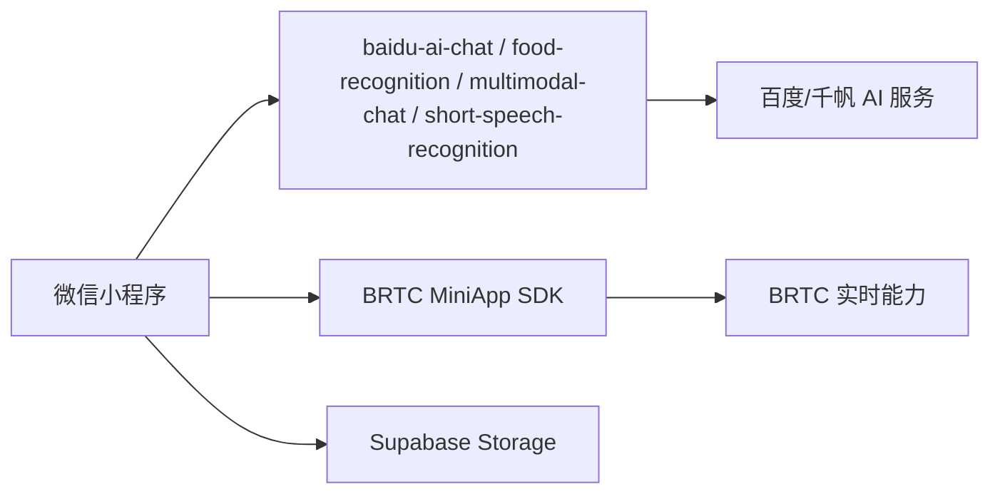
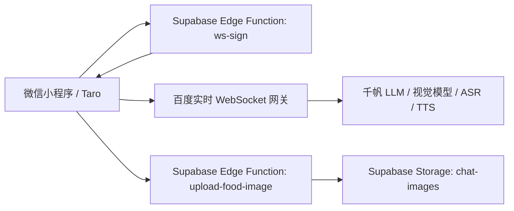
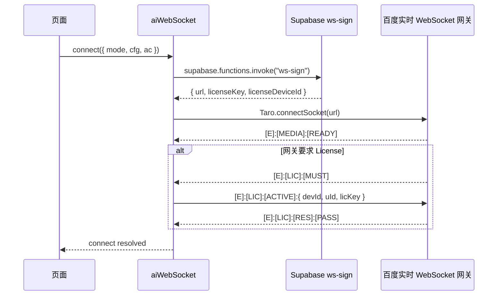
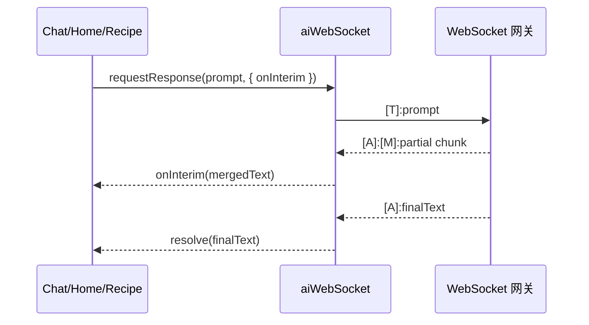
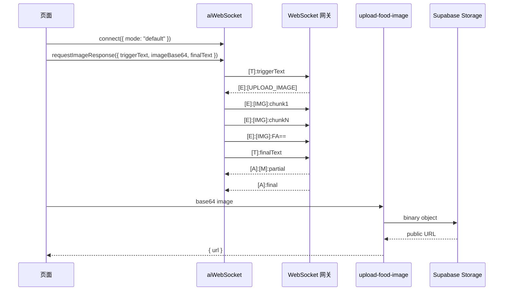
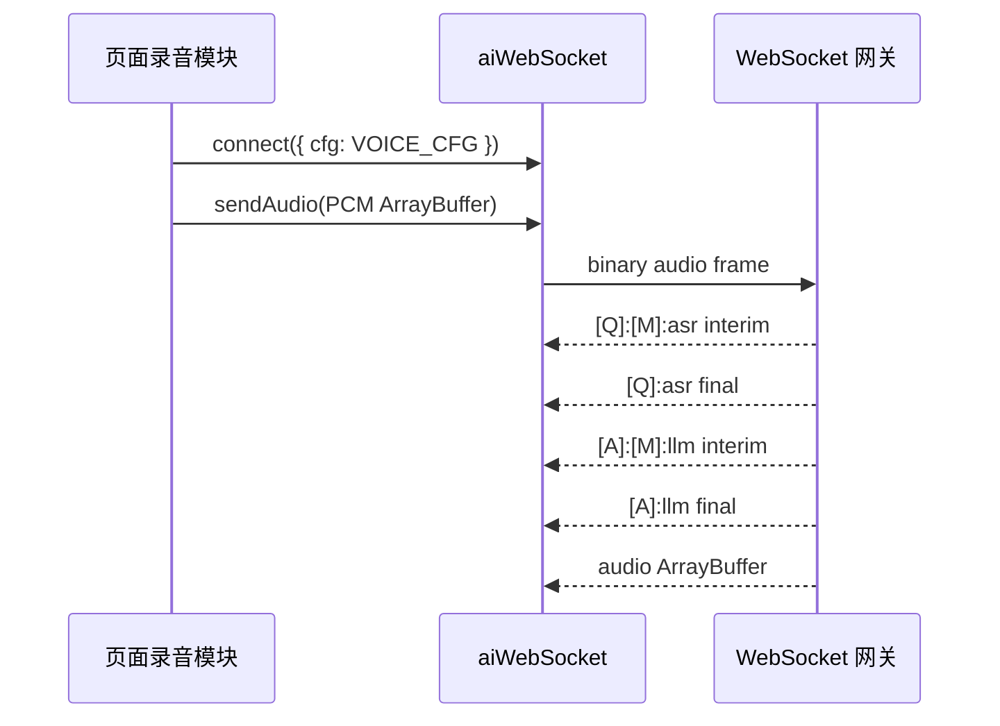

# WebSocket API 迁移报告

生成日期：2026-06-25

## 1. 项目背景

本次迁移目标是将微信小程序内的 AI 能力从早期的 Supabase Edge Function 聚合接口和 BRTC MiniApp SDK 方案，迁移到百度实时 WebSocket 网关方案。迁移后，前端通过 Taro WebSocket 能力直接与实时网关通信，Supabase 仅保留必要的签名、鉴权中转与图片持久化能力。

迁移覆盖以下业务链路：

- AI 健康问答：文字问题、图片问题、多轮咨询。
- 首页综合营养分析：基于称重食材、人数和健康档案生成营养分析。
- AI 菜谱推荐：基于当前食材生成菜谱。
- 食物图片识别：拍照/相册图片识别食材名，并上传图片用于后续展示。
- 短语音输入与实时语音对话：录音或帧数据发送到 WebSocket ASR/LLM/TTS 链路。

迁移后主要收益：

- AI 交互链路统一到一个 WebSocket 服务封装中，减少多套 Edge Function 分支逻辑。
- 支持 LLM 中间结果 `llm-interim`，用户可见长文本输出均已接入流式渲染。
- 图片识别按网关要求改为事件驱动上传，解决直接传图与上传时机不一致的问题。
- BRTC AK/SK、License 等敏感网关凭据迁移到 Supabase Edge Function secret，不在小程序端暴露。

## 2. 迁移前后架构对比

### 迁移前



迁移前存在的问题：

- AI 能力分散在多个 Edge Function 与 SDK 入口中，调试链路较长。
- WebSocket、图片识别、语音识别、聊天问答各自有独立实现，错误处理不一致。
- 部分能力依赖 SDK 或隐藏音视频组件，微信权限与兼容风险较高。
- 长文本结果只能等待最终响应，用户体感延迟明显。

### 迁移后



迁移后的职责划分：

- `supabase/functions/ws-sign/index.ts`：生成实时 WebSocket URL，返回 License 信息。
- `src/services/aiWebSocket.ts`：小程序端唯一 WebSocket 客户端封装，负责连接、消息分发、图片分片、超时、流式回调。
- `src/utils/brtcConfig.ts`：维护聊天、视觉、语音三类模型配置。
- `supabase/functions/upload-food-image/index.ts`：仅负责图片持久化到 Supabase Storage。
- 页面层负责业务上下文拼接、状态展示、流式渲染和数据库落库。

## 3. 核心文件清单

| 类型 | 文件 | 职责 |
|---|---|---|
| WebSocket 签名 | `supabase/functions/ws-sign/index.ts` | 读取 BRTC secret，拼接网关 URL，返回 License 配置 |
| WebSocket 客户端 | `src/services/aiWebSocket.ts` | 连接管理、协议解析、流式回调、图片分片、ASR/LLM/TTS 消息分发 |
| 模型配置 | `src/utils/brtcConfig.ts` | `CHAT_CFG`、`VISION_CFG`、`VOICE_CFG` |
| Prompt 与结果清洗 | `src/utils/aiPromptHelpers.ts` | 聊天 prompt、识图 prompt、食材名清洗 |
| 首页 AI | `src/pages/home/index.tsx` | 食材识别、营养分析、短语音输入 |
| 问答页 AI | `src/pages/chat/index.tsx` | 文字问答、图片问答、实时语音对话 |
| 菜谱 AI | `src/pages/recipe/index.tsx` | 菜谱推荐流式生成 |
| 图片上传 | `supabase/functions/upload-food-image/index.ts` | base64 图片上传到 Storage |
| 回归检查 | `scripts/checkChatStreaming.mjs` | 检查流式输出关键路径 |
| 回归检查 | `scripts/checkAiPromptHelpers.mjs` | 检查 prompt 和食材识别清洗规则 |

## 4. 运行时配置

### Supabase Edge Function secrets

必须配置：

- `BAIDU_BRTC_AK`
- `BAIDU_BRTC_SK`
- `BAIDU_BRTC_APPID`
- `BAIDU_BRTC_LICENSE_KEY`
- `BAIDU_BRTC_LICENSE_DEVICE_ID`
- `SUPABASE_URL` 或 `APP_SUPABASE_URL`
- `SUPABASE_SERVICE_ROLE_KEY` 或 `APP_SUPABASE_SERVICE_ROLE_KEY`

说明：

- `BAIDU_BRTC_AK`、`BAIDU_BRTC_SK`、License 信息仅在 `ws-sign` 侧读取。
- `SUPABASE_SERVICE_ROLE_KEY` 仅用于 `upload-food-image` 服务端上传 Storage，不应进入小程序端。
- 当前 `src/utils/brtcConfig.ts` 中仍有 LLM token 配置，用于传给实时网关 cfg。正式生产若要求完全无前端 token，应进一步将 cfg 构建迁移到 `ws-sign` 服务端。

### 微信小程序后台配置

需要配置：

- socket 合法域名：`wss://rtc-aiotgw.exp.bcelive.com`
- request 合法域名：Supabase 项目域名
- upload/download 相关域名：Supabase Storage 域名

本地调试可临时关闭合法域名校验；正式上传和提审必须在微信公众平台配置合法域名。

### 小程序代码质量配置

已在 `src/app.config.ts` 增加：

```ts
lazyCodeLoading: 'requiredComponents'
```

构建产物 `dist/app.json` 会生成：

```json
"lazyCodeLoading": "requiredComponents"
```

用于通过微信开发者工具“启用组件按需注入”代码质量扫描项。

## 5. 信息传输流程

### 5.1 连接建立流程



连接完成条件：

- 收到 `[E]:[MEDIA]:[READY]`。
- 如收到 `[E]:[LIC]:[MUST]`，则需 License 激活通过；若 License 失败，当前客户端会降级放行，避免阻塞基础链路。

### 5.2 文本问答流程



已接入流式输出的页面：

- `src/pages/chat/index.tsx`：文字问答使用临时 AI 气泡实时更新。
- `src/pages/chat/index.tsx`：图片问答在上传完成后也使用同一个临时 AI 气泡更新。
- `src/pages/home/index.tsx`：综合营养分析边生成边渲染 Markdown。
- `src/pages/recipe/index.tsx`：菜谱推荐边生成边渲染 Markdown。

超时策略：

- 普通文本默认 30 秒。
- 如果超时时已有 `llm-interim`，返回中间结果作为可用答案。
- 没有任何中间结果时才抛出超时错误。

### 5.3 图片识别/图片问答流程



图片发送协议：

- 首包：`\x18[T]=binary;[N]=<fileName>\n` + 图片 bytes。
- 中间包：`\x10` + 图片 bytes。
- 单片大小：16KB。
- 结束包：`\x14`，base64 后为 `FA==`。

设计原因：

- 网关会先通过 `[E]:[UPLOAD_IMAGE]` 明确请求上传图片，客户端不可提前发送图片。
- 食物识别和聊天图片问答都使用该事件驱动上传方式。
- 图片持久化与 AI 识别并发进行：识别走 WebSocket，展示 URL 走 `upload-food-image`。

### 5.4 语音输入与实时语音流程



当前实现：

- 首页短语音输入：录音完成后发送 PCM，等待 `[Q]` 最终 ASR 文本填入食材名。
- 问答页实时语音：录音帧持续发送，ASR 与 LLM 中间结果实时更新临时消息。
- 不再依赖 `live-pusher`、`live-player` 或 BRTC MiniApp SDK 隐藏组件。

## 6. 协议前缀说明

| 前缀 | 含义 | 客户端处理 |
|---|---|---|
| `[E]:[MEDIA]:[READY]` | 媒体/会话准备完成 | 标记连接可用 |
| `[E]:[LIC]:[MUST]` | 要求 License 激活 | 发送 License 激活事件 |
| `[E]:[LIC]:[RES]:[PASS]` | License 激活成功 | 允许连接完成 |
| `[E]:[UPLOAD_IMAGE]` | 网关请求上传图片 | 发送图片分片 |
| `[Q]:[M]:...` | ASR 中间结果 | 触发 `asr-interim` |
| `[Q]:...` | ASR 最终结果 | 触发 `asr-final` |
| `[A]:[M]:...` | LLM 中间结果 | 触发 `llm-interim`，用于流式 UI |
| `[A]:...` | LLM 最终结果 | 触发 `llm-final`，用于落库/最终替换 |
| ArrayBuffer | 音频数据 | 触发 `audio` |

## 7. 已落地的业务链路

### AI 健康问答

- 文字问答：`CHAT_CFG` + `requestResponse`。
- 图片问答：`mode: "default"` + `requestImageResponse`。
- 流式展示：临时 assistant 气泡接收 `onInterim`，最终结果落库后替换临时气泡。
- Prompt 已压缩为“400 字以内、先结论、3-5 条建议”，减少生成时间。

### 首页营养分析

- 使用 `CHAT_CFG` 和 `requestResponse`。
- 输出要求仍包含 JSON block，用于提取 calories/protein/fat/carbs。
- UI 流式显示时会先隐藏 JSON block，仅展示正文 Markdown。
- 最终结果保存到称重记录表。

### 食物拍照识别

- 使用默认视觉 Agent，先发送 trigger prompt。
- 等待 `[E]:[UPLOAD_IMAGE]` 后按 16KB chunk 上传图片。
- 识别结果通过 `parseRecognizedFoods` 清洗，只保留食材名。
- 同时调用 `upload-food-image` 将图片保存到 Storage。

### AI 菜谱推荐

- 使用 `CHAT_CFG` 和 `requestResponse`。
- 生成内容边输出边渲染 Markdown。
- 最终内容用于提取菜名、继续咨询上下文和分享。

### 语音能力

- 短语音输入和实时语音均走 `VOICE_CFG`。
- PCM 音频通过 WebSocket binary frame 发送。
- ASR/LLM 中间结果已在消息层分发。

## 8. 测试方案

### 8.1 单元/静态回归检查

已新增两个轻量检查脚本：

```bash
node scripts/checkAiPromptHelpers.mjs
node scripts/checkChatStreaming.mjs
```

覆盖内容：

- 食物识别清洗：`这个啊...草莓`、`让我看看.番茄` 等口语前缀会被移除。
- 聊天 prompt 包含长度限制、结论优先、医疗免责声明。
- WebSocket 文本和图片问答均暴露 `onInterim`。
- 普通聊天、图片聊天、首页营养分析、菜谱推荐均接入流式输出。
- 小程序 textarea 不再直接操作 DOM `target.style.height`。

### 8.2 构建验证

```bash
corepack pnpm build:weapp
```

通过标准：

- Taro 编译成功。
- `dist/app.json` 包含 `lazyCodeLoading: "requiredComponents"`。
- 无阻断性 TypeScript/Vite/Taro 构建错误。

当前已验证结果：

- `scripts/checkAiPromptHelpers.mjs` 通过。
- `scripts/checkChatStreaming.mjs` 通过。
- `corepack pnpm build:weapp` 通过。

### 8.3 Edge Function 验证

建议使用 Supabase CLI 或控制台验证：

```bash
supabase functions deploy ws-sign --project-ref <project-ref>
supabase functions deploy upload-food-image --project-ref <project-ref>
```

验证 `ws-sign`：

```bash
curl -X POST "https://<project-ref>.supabase.co/functions/v1/ws-sign" \
  -H "Authorization: Bearer <ANON_KEY>" \
  -H "Content-Type: application/json" \
  --data '{"mode":"default","ac":"raw16k"}'
```

期望：

- HTTP 200。
- 返回 `url`，以 `wss://rtc-aiotgw.exp.bcelive.com/v1/realtime` 开头。
- 返回 License 相关字段，但不应在日志或文档中明文泄露 secret。

验证 `upload-food-image`：

```bash
curl -X POST "https://<project-ref>.supabase.co/functions/v1/upload-food-image" \
  -H "Authorization: Bearer <ANON_KEY>" \
  -H "Content-Type: application/json" \
  --data '{"image":"data:image/jpeg;base64,<base64>","ext":"jpg"}'
```

期望：

- HTTP 200。
- 返回 `{ "url": "https://.../storage/v1/object/public/chat-images/..." }`。

### 8.4 小程序端验收用例

| 用例 | 操作 | 预期 |
|---|---|---|
| 文字问答 | AI 问答页输入“今天吃什么比较健康” | AI 气泡流式出现，最终无重复气泡 |
| 图片问答 | AI 问答页上传食物图片并提问 | 上传后 AI 气泡流式输出图片分析 |
| 食物识别 | 首页拍摄番茄图片 | 食材名只显示“番茄”，无“让我看看”等前缀 |
| 营养分析 | 首页添加食材后点“综合营养分析” | Markdown 内容边生成边展示，最终保存记录 |
| 菜谱推荐 | 从首页进入菜谱推荐 | 菜谱内容边生成边展示 |
| 短语音输入 | 首页录音说食材名 | ASR 最终文本填入食材名 |
| 实时语音 | AI 问答页开启语音通话 | ASR/AI 中间文本实时更新 |
| 上传扫描 | 微信开发者工具代码质量扫描 | “启用组件按需注入”通过 |

## 9. 落地实施方案

### 阶段一：配置与函数部署

1. 在 Supabase 配置 Edge Function secrets。
2. 部署 `ws-sign`。
3. 部署 `upload-food-image`。
4. 在微信公众平台配置 socket/request/storage 合法域名。
5. 本地执行 `corepack pnpm build:weapp`。

### 阶段二：灰度联调

1. 微信开发者工具启用真机调试。
2. 使用默认视觉 Agent 验证图片上传事件链路。
3. 使用 `CHAT_CFG` 验证文字问答、营养分析、菜谱生成。
4. 使用 `VOICE_CFG` 验证短语音和实时语音。
5. 打开控制台观察关键日志：
   - `ws-sign OK`
   - `[E]:[MEDIA]:[READY]`
   - `[E]:[UPLOAD_IMAGE]`
   - `[A]:[M]`
   - `[A]`

### 阶段三：生产发布

1. 确认所有 secret 已配置到生产 Supabase 项目。
2. 确认小程序合法域名已配置到正式 AppID。
3. 执行回归脚本与构建。
4. 上传微信代码包。
5. 执行代码质量扫描。
6. 发布体验版，覆盖核心验收用例。
7. 提交审核。

## 10. 风险与应对

### 风险一：最终 `[A]` 响应超时

现象：控制台持续出现 `[A]:[M]`，但最终 `[A]` 未及时返回。

应对：

- 客户端已累计 `llm-interim`。
- 超时时若已有中间结果，则返回中间结果并继续落库/展示。
- 无中间结果时才提示失败。

### 风险二：视觉模型重复请求上传图片

现象：上传完成后网关再次返回 `[E]:[UPLOAD_IMAGE]`。

应对：

- 客户端通过 `imageSent` 标记忽略重复上传事件。
- final prompt 明确“图片已上传完成，不要再次请求上传图片”。

### 风险三：识别结果带口语前缀

现象：结果为 `让我看看.番茄`、`这个啊...草莓`。

应对：

- prompt 层限制“只输出食材名”。
- 展示层通过 `parseRecognizedFoods` 二次清洗。
- 回归脚本覆盖常见口语前缀。

### 风险四：WebSocket 并发连接状态卡死

现象：上一次连接失败后，下一次调用一直处于 connecting。

应对：

- 连接失败、签名失败、onError、onClose、超时均重置 `state`。
- 并发连接等待增加 disconnected 和超时检测。
- `disconnect()` 统一清理 socket、promise、listener 与 ready 状态。

### 风险五：微信权限和组件扫描

现象：上传代码质量扫描提示按需注入未通过，或音视频权限异常。

应对：

- 已配置 `lazyCodeLoading: "requiredComponents"`。
- 当前语音链路使用录音与 WebSocket binary frame，不依赖 `live-pusher/live-player`。
- 普通流式文本输出不涉及实时音视频权限。

### 风险六：前端仍存在 LLM token

现象：`src/utils/brtcConfig.ts` 仍需向网关传递 `llm_token`。

应对建议：

- 短期：保持现状，AK/SK 与 service role 已不在前端。
- 中期：将完整 cfg 构建迁移到 `ws-sign`，前端仅传业务模式，如 `chat`、`voice`、`vision`。
- 长期：由服务端做模型路由、额度控制和审计日志。

## 11. 运维与监控建议

建议在后续版本补充以下监控：

- `ws-sign` 调用成功率、失败原因、平均耗时。
- WebSocket 连接成功率、`MEDIA READY` 等待耗时。
- `[A]:[M]` 首 token 延迟。
- 最终 `[A]` 完成率与超时率。
- 图片上传事件等待耗时、图片分片数量、上传失败率。
- ASR 最终结果成功率。
- Supabase Storage 上传成功率。

日志建议：

- 客户端保留 URL prefix，不记录完整签名 URL。
- 不记录 AK/SK、License、service role、LLM token。
- 生产环境可降低 `[AiWebSocket] recv` 明文日志等级，避免用户隐私进入日志。

## 12. 后续优化建议

1. **服务端 cfg 托管**：将 `CHAT_CFG`、`VOICE_CFG`、视觉模式配置迁移到 `ws-sign`，前端只传 mode。
2. **子包拆分**：当前主包页面较多，可按登录/设备/AI/统计拆分 subpackage，进一步优化上传扫描和启动性能。
3. **统一 AI 请求状态机**：将页面层的 loading、streaming、final、error 抽成 hook，减少重复。
4. **端到端自动化验收**：增加小程序模拟或接口级 E2E，覆盖文字、图片、语音三类链路。
5. **用户隐私治理**：对健康档案、图片内容、语音文本增加日志脱敏和数据保留策略。

## 13. 最终结论

本次 WebSocket API 迁移已完成从“多 Edge Function / SDK 分散调用”到“统一 WebSocket 客户端 + Supabase 签名服务”的架构收敛。核心 AI 链路已完成端到端落地：

- 文本问答、图片问答、营养分析、菜谱推荐均支持流式输出。
- 食物识别已完成事件驱动图片上传、结果清洗和图片持久化。
- 语音输入与实时语音已通过 WebSocket 协议统一接入。
- Supabase 保留签名和图片上传两个必要服务，敏感网关凭据不再暴露于小程序端。
- 已完成脚本回归检查和 Taro 微信小程序构建验证。

建议按“配置部署、灰度联调、体验版验收、正式提审”的路径推进上线，并将“服务端 cfg 托管”和“运行时监控”作为下一阶段生产增强重点。
